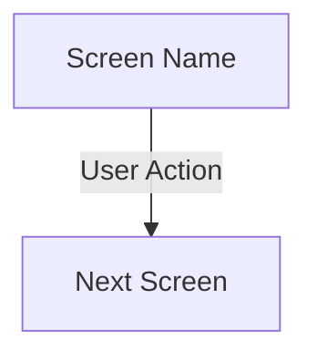
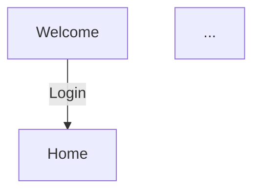

# Generate App Navigation Map

Systematically explore a mobile app and produce a Mermaid flowchart that shows every screen and how users navigate between them.

## Before You Start
1. Run the `morbius-preflight` skill — need a device running with the app installed
2. Identify which project you're mapping (check `data/projects.json` for active project)

## How to Explore

### Step 1: Launch the app fresh
```bash
adb shell am force-stop <APP_ID>
adb shell pm clear <APP_ID>
adb shell am start -n <APP_ID>/.MainActivity
```

### Step 2: Screenshot and document the first screen
```
mcp__maestro__take_screenshot
mcp__maestro__inspect_view_hierarchy
```

For each screen, record:
- **Screen name** (what the header/title says)
- **Elements visible** (buttons, tabs, inputs, cards, menus)
- **Actions available** (what can you tap to go somewhere new)

### Step 3: Tap every action and screenshot the result
Go breadth-first through the navigation tree:
1. From the first screen, tap each button/link/tab
2. Screenshot the new screen
3. Document it
4. Go back
5. Tap the next action
6. Repeat until you've seen every screen

### Step 4: Map menus and sub-screens
When you find a ⋮ menu or settings gear:
- Open it, screenshot the options
- Tap each option, document what screen it leads to
- Go back

### Step 5: Note which screens are covered by Maestro flows
Compare with existing YAML flow files. If a flow tests a screen, that node gets colored green.

## How to Write the Mermaid Definition

### Syntax


### Node types
- `["Screen Name"]` — regular rectangle (standard screen)
- `{"Menu Name"}` — diamond (decision/menu with multiple options)
- `(["Rounded"])` — rounded for modals/overlays

### Naming convention
- Node IDs: UPPER_SNAKE_CASE (e.g., `HUB_HOME`, `SENSOR_DETAIL`)
- Labels: Human-readable with emoji for key screens (🏠 Home, 🔔 Notifications, ⚙ Settings)
- Edge labels: The user action (e.g., `|Tap Sign In|`, `|Swipe Left|`)

### Color coding
```
style HOME fill:#34D399,stroke:#333,color:#000
```
- `#34D399` (green) — Screen is covered by a Maestro flow
- Default (no style) — Screen is NOT automated yet

## How to Save

### 1. Update the project config.json
Add the `appMap` field with the Mermaid definition (newlines as `\n`):
```json
{
  "appMap": "graph TD\n    START[\"Welcome\"] -->|Login| HOME[\"Home\"]\n    ..."
}
```

### 2. Also save as APP_MAP.md in the testing repo
Create a markdown file that renders on GitHub:
```markdown
# App Navigation Map


```

### 3. Verify on the dashboard
Start the dashboard → click "App Map" in the sidebar → Mermaid chart renders.

## Tips
- Don't try to map every possible state — focus on main navigation paths
- External webviews are leaf nodes — just note they open externally
- Modals and bottom sheets branch from their parent screen
- If a screen has tabs, show each tab as a separate node
- Run this skill ONCE per project, then update as the app changes
