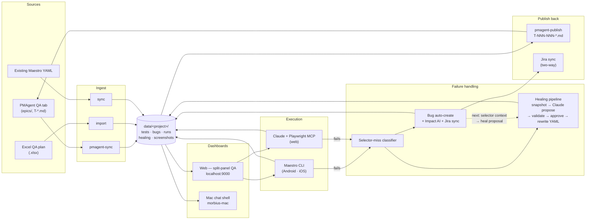

# Morbius

**A QA harness engine for mobile + web automation.** Orchestrates Maestro flows, runs web tests via Claude + Playwright MCP, self-heals broken selectors, tracks bugs end-to-end, and round-trips test plans with PMAgent. Local-first, file-backed, no database.

> **Two complementary surfaces, one core.**
> **Web app** (`src/`, served on `localhost:9000`) — team dashboard: test plans, runs, bugs, healing queue, AppMap.
> **Mac app** (`morbius-mac/`) — chat-first agentic shell for engineers (v0.1 shipped; agent runtime is mocked, swap-in-ready for the Anthropic SDK). See [`morbius-mac/README.md`](morbius-mac/README.md).
>
> *Future direction:* web = team board, Mac = engineer driver — they specialize, not duplicate.

---

## Quick start

```bash
git clone https://github.com/sdas788/Morbuis.git Morbius
cd Morbius
npm install
npm run build
node dist/index.js serve --port 9000
```

Open **http://localhost:9000**.

Then bring a project in via **either** of these:

```bash
# A) Pull a QA plan from a sibling PMAgent project (recommended)
node dist/index.js pmagent-sync ch-mobile

# B) Import an Excel test plan
node dist/index.js import "path/to/QA Plan.xlsx"
```

Switch projects from the sidebar; the active project's tests, bugs, runs, and healing queue load instantly.

---

## End-to-end flow



Solid edges are shipped today. The dashed edge from **Bug → Healing** is the next integration (see [Bug tracking](#bug-tracking--the-missing-edge) below).

---

## Project bootstrap

Each project is one entry in `data/projects.json`. Minimal fields:

```jsonc
{
  "id": "ch-mobile",                           // stable Morbius ID
  "name": "Cooper's Hawk Mobile",
  "projectType": "mobile",                     // mobile | web | api
  "pmagentSlug": "ch-mobile",                  // optional — links to PMAgent project
  "codebasePath": "https://github.com/org/ch-mobile",  // GitHub URL or local clone — used to locate/generate builds
  "appId": "com.cooperhawk.app",
  "webUrl": "http://localhost:3000",           // for web projects only
  "maestro": {
    "androidPath": "/path/to/Android test",
    "iosPath":     "/path/to/IOS app"
  },
  "devices": [
    { "id": "iphone", "name": "iPhone", "platform": "ios" },
    { "id": "android-phone", "name": "Android Phone", "platform": "android" }
  ],
  "env": { "TEST_EMAIL": "", "TEST_PASSWORD": "" },
  "prerequisites": [
    "Maestro CLI installed",
    "Simulator/emulator running",
    "App build installed on device"
  ]
}
```

**`codebasePath`** can be a GitHub URL or a local clone. Morbius uses it to locate the app source so test builds can be generated (the STS project uses this today — see `data/projects.json`). Future tooling will trigger builds straight from this field.

---

## Capabilities

| Area | Status |
|---|---|
| PMAgent bidirectional bridge (preview · transfer · publish-test-plans) | ✅ |
| Self-healing selectors (E-017) | ✅ |
| Maestro mobile runner (Android + iOS, live WebSocket streaming) | ✅ |
| Web runner via Claude + Playwright MCP (E-024 — headless and visual modes) | ✅ |
| Bug tracking + **Bug Impact AI** (rerun · manual-verify · risk score) | ✅ |
| Jira two-way sync (webhook + replay queue) | ✅ |
| AppMap + AppMap Storyteller | ✅ |
| Device fleet detection (`adb devices` + `xcrun simctl`) | ✅ |
| Excel two-way sync (import · export) | ✅ |
| Multi-project registry | ✅ |
| Mac shell v0.1 (Electron + mocked agent runtime, swap-in-ready) | ✅ |
| **Report Bug → auto-enqueue healing proposal** | 🔜 next |
| Cloud deploy on Fly.io (E-025) | 🟡 in progress |
| Anthropic Managed Agents migration (E-026) | 🔜 |
| BrowserStack cloud runs | 🔜 |
| Multi-tenant SaaS | 🔜 |

---

## Self-healing — how it actually works

When a Maestro flow fails because a selector no longer matches, Morbius doesn't just log the failure — it tries to fix it.

**State machine:** `requested → snapshotting → proposed → validating → validated | invalidated → approved → applied`

1. **Classify.** The run output is parsed for selector-miss signatures ("No visible element found", "Element not found", "Timeout waiting for element") in [`src/server.ts:3273-3310`](src/server.ts).
2. **Snapshot.** `maestro hierarchy` captures the current view tree (XML, truncated to ~80 KB).
3. **Propose.** Claude is given the failing selector + snapshot and returns a JSON proposal with `proposedSelector`, `confidence` (0..1), and `rationale`.
4. **Validate.** Morbius re-runs the flow with the new selector. The result flips the state to `validated` or `invalidated`.
5. **Approve.** A reviewer opens the **Healing** tab, reads the rationale, optionally edits the selector, and approves. Low-confidence proposals (<0.5) are flagged for manual review.
6. **Apply.** The approved selector is written back into the YAML atomically and a changelog entry is recorded.

**Storage:** `data/<project>/healing/proposal-<id>.md` (markdown + frontmatter).
**API:** `/api/healing` (list), `/api/healing/:id` (get), `/api/healing/propose`, `/api/healing/:id/{modify,approve,reject}` ([`src/server.ts:1819-1913`](src/server.ts)).
**UI:** the **Healing** tab — `HealingQueueView`, polls every 8s, groups proposals by state, shows confidence band, lets you preview the hierarchy snapshot, modify the selector, approve, or reject.

---

## Bug tracking + the missing edge

**Today (shipped):**

- `POST /api/bugs/create` ([`src/server.ts:911-947`](src/server.ts)) — accepts title, priority, category, `linkedTest`, device, failure reason, repro steps, notes; auto-assigns `BUG-NNN`.
- `morbius ingest <maestro-dir>` — parses Maestro run logs and auto-creates bug tickets for failures with screenshots.
- **Bugs board** — Kanban (Open · Investigating · Fixed · Closed) at `BugsView`.
- **BugDrawer** — full bug detail with timeline, screenshot, and `linkedTest` deep-link.
- **Bug Impact AI** — `POST /api/bug/:id/impact/generate` runs Claude over the linked test + dependents and returns `rerun` / `manualVerify` lists + a repro narrative + a risk-score band.
- **Jira two-way sync** — webhook receiver, replay queue for failed syncs, per-bug `J · {KEY}` badge.

**Next (🔜 — the dashed edge in the diagram):** a functional **Report Bug** button. The button exists today as a stub in the Bugs toolbar ([`src/server.ts:12433`](src/server.ts)) — clicking it doesn't open a form yet. The planned wiring:

1. Open a Report-Bug modal pre-filled from the active test / failing run.
2. Capture selector context (failing selector, line, hierarchy hint) from the most recent run.
3. Create the bug via `POST /api/bugs/create`.
4. If the failure looks like a selector miss, also `POST /api/healing/propose` to enqueue a healing proposal — closing the loop between human-filed bugs and automated repair.

---

## Commands

| Command | What it does |
|---|---|
| `morbius serve [--port N]` | Start the dashboard (default port 3000) |
| `morbius import <xlsx>` | Import test cases from Excel into the active project |
| `morbius export <xlsx>` | Export dashboard changes back to Excel |
| `morbius sync` | Link Maestro YAML flows to test cases by QA Plan ID |
| `morbius ingest <maestro-dir>` | Ingest a Maestro run dir; auto-create bugs for failures |
| `morbius ingest-media` | Copy latest run videos/screenshots into the project media folder |
| `morbius create-bug` | Manually create a bug ticket |
| `morbius validate` | Check data integrity — broken links, orphaned files, missing paths |
| `morbius generate-flows` | Generate Maestro YAML flows from `calculatorConfig.json` |
| `morbius pmagent-sync <slug>` | Pull a PMAgent project's QA plan into Morbius |
| `morbius pmagent-publish <slug>` | Publish Morbius test cases back as `T-NNN-NNN-*.md` test plans in PMAgent epics |
| `morbius run-web <testId> [--visual]` | Run a web test via Claude + Playwright MCP (E-024) |

Full reference: `node dist/index.js --help`.

---

## Where data lives

Everything is markdown + JSON files on disk.

```
data/
  projects.json                ← Registry + active project ID
  <projectId>/
    config.json                ← App ID, Maestro paths, devices, env vars, Jira creds
    tests/
      <category>/<test>.md     ← One markdown file per test case
    bugs/
      <BUG-id>.md              ← Bug with linkedTest, screenshot ref
      <BUG-id>/impact.md       ← Bug Impact AI output
    healing/
      proposal-<id>.md         ← Healing state machine
    runs/
      <runId>.json             ← MaestroRunRecord
      <testId>-latest.json     ← Quick pointer to most recent run
    screenshots/<runId>/       ← Failure screenshots
    pmagent-sync-state.json    ← Per-project sync metadata (PMAgent bridge)
```

A PMAgent-synced test case carries its source lineage in frontmatter:

```yaml
---
id: TC-CH--001-001-1
title: Guest Browsing — Test Plan
category: e-001-auth-onboarding
status: not-run
priority: P2
platforms: [android, ios]
pmagent_source:
  slug: ch-mobile
  story_id: S-001-001
  ac_index: 0
  source_checksum: dca07c24901ff624
pmagent_locked: false   # set true to pin against upstream changes
---
```

---

## Philosophy: feature-area flows

We map Maestro flows to the **screens users actually touch**, not one file per Excel row. Shared `login.yaml` / `setup.yaml` helpers stay in one place. Flows are numbered so setup runs first and destructive ones run last. The trade-off — fewer files, each covering multiple test cases — keeps a 150-row QA plan from becoming 150 brittle YAML files. Concrete project examples live in each project's own docs, not here.

---

## Prerequisites

- **Node.js 18+**
- **Maestro CLI** — `brew install maestro` or `curl -Ls "https://get.maestro.mobile.dev" | bash`
- **Claude Code** — required for healing proposals, Bug Impact AI, and the chat drawer
- *(optional)* **Android SDK** for Android device runs
- *(optional)* **Xcode** for iOS simulator runs
- *(optional)* `PMAGENT_HOME` env var — points to the sibling PMAgent checkout (default `~/PMAgent`)
- *(optional)* Jira creds in `config.json` per project for Jira two-way sync
- *(optional)* `ANTHROPIC_API_KEY` for SaaS / Managed-Agents paths

---

## Repo layout

```
src/                  Web server + embedded React dashboard (single file: src/server.ts)
morbius-mac/          Electron Mac app (chat-first agentic shell, E-001…E-015 shipped)
data/                 Per-project markdown DB + projects.json registry
flows/                Maestro YAML — feature-area flows
requirements/         Brief, epics (E-001 → E-027), releases, arch.md, design tokens
dist/                 Compiled JS (output of `npm run build`)
```

---

## Roadmap

| Phase | What | Status |
|---|---|---|
| 1 — MVP | Dashboard + Excel import + multi-project | ✅ |
| 2 — Agent + Chat | Inline edits, changelog, chat drawer | ✅ |
| 2.5 — Maestro restructure | Feature-area flows, AppMap | ✅ |
| E-017 — Self-healing selectors | Classify → snapshot → propose → validate → approve | ✅ |
| E-023 — PMAgent bridge | preview · transfer · publish-test-plans | ✅ |
| E-024 — Web test runner | Claude + Playwright MCP (headless + visual) | ✅ |
| Mac v0.1 | Electron shell, permission ladder, kill switch, mocked agent | ✅ |
| E-016 — Bug → Healing edge | Functional Report-Bug button → heal proposal | 🔜 next |
| E-025 — Cloud deploy | Fly.io + Cloudflare Access, hosted markdown DB | 🟡 |
| BrowserStack | One-click cloud runs | 🔜 |
| E-026 — Managed Agents | Anthropic-hosted agent runtime | 🔜 |
| SaaS | Auth, multi-tenant, hosted | 🔜 |

See [`ROADMAP.md`](./ROADMAP.md) and `requirements/releases/` for the full phase plan.

**The repeatable pipeline** (onboard → app map → automation plan → review → author → run → heal → bug), with each stage's owning skill/CLI and the guardrails that prevent regressions, is documented in **[`requirements/HARNESS.md`](./requirements/HARNESS.md)**. Run `node dist/index.js doctor` to self-check harness health.

---

## Future: web + Mac complement each other

Today the web app and Mac app are independent surfaces with overlapping capability. The direction: **web becomes the team board** (PMAgent QA tab on steroids — coverage, runs, healing queue, Jira), **Mac becomes the engineer driver** (chat-first, AppMap exploration, kill switch, permission ladder, runs against the local fleet). They share the same on-disk markdown DB so a project authored on Mac shows up immediately on the web board. This split is roadmap, not done — flagged so it informs decisions today.
