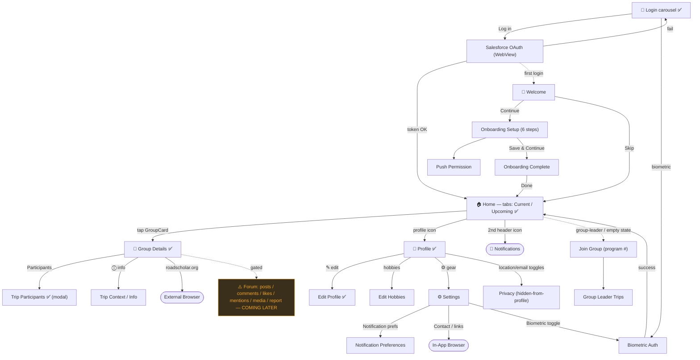

# Road Scholar Mobile — App Navigation Map

React Navigation v6 (Stack + Bottom Tabs + Drawer). RN 0.73.11. Staging appId `com.roadscholar.mobile.dev`.

**Verified live on `emulator-5554` (2026-05-27)** — logged in as `diana olariu` (didi.ola staging account, **Group Leader**). ✅ = live-verified screen. ⚠️ = feature present in spec but **gated "Coming to the app later this year!" in this build** — not testable yet. Plain = design-derived (`reference/design/screens/DS-*.md`), not yet reached live. No nodes are green: zero Maestro flows exist yet.

## Build-state reality check (vs synced test plans)

| Epic | Spec'd screens | Live in this build? |
|------|----------------|---------------------|
| E-001 Auth/Onboarding | Login ✅, OAuth, Biometric, Welcome, Setup | Session persists (logged in); login flow needs logout to exercise |
| E-002 Group Community | Group list ✅, Group Details ✅, Participants ✅ — **forum/posts/comments/likes/mentions/media/report** | ⚠️ **forum DARK** — "Coming later" placeholder |
| E-003 Profile | Profile ✅, Edit ✅, Hobbies, Privacy | **Fully live** |
| E-004 Leader Tools | Participants ✅, Join Group, Leader Trips | Account is Group Leader — testable |
| E-005 Notifications | Prefs, channels | Reachable via Settings (unverified) |
| E-006 Trip Context | Trip info (ⓘ), group card details ✅ | Live (card data present) |
| E-007 Offline | queued actions, reconnect | Not exercised (emulator) |
| E-008 Settings | Settings, browser, biometric | Reachable via Profile gear (unverified) |
