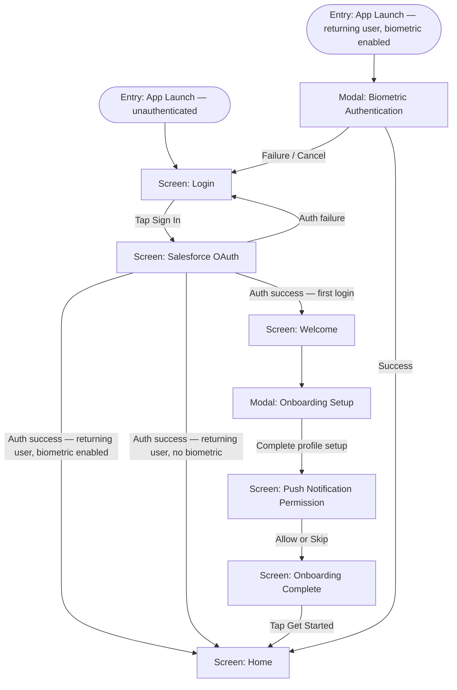

**ID:** UF-001
**Project:** roadscholar-mobile
**Epic:** E-001
**Persona:** First-time participant logging in and setting up their account
**Stage:** Ready
**Version:** 1.0
**Created:** 2026-03-28
**Updated:** 2026-03-28

---

# User Flow: Login & Onboarding

## Overview

Covers the complete first-time user journey from app launch through Salesforce SSO login, optional biometric setup, welcome walkthrough, notification permission prompt, and arrival at the home screen. Also covers the returning-user fast path via biometric re-authentication.

## Entry Point

App launch (unauthenticated state)

## Stories Covered

S-001-001, S-001-002, S-001-003, S-001-004

## Flow

## Screens

### Login

**Purpose:** Entry gate for all users. Prompts sign-in via Salesforce SSO. No email/password option exists — authentication is Salesforce only.

**Key content:**
- Road Scholar logo and app name
- "Sign In" button (triggers Salesforce OAuth web view)
- App version number (footer)

**Primary action:** Tap Sign In → opens Salesforce OAuth screen

**Transitions:**
- Sign In → Salesforce OAuth screen
- (Returned to from Salesforce OAuth on auth failure)
- (Returned to from Biometric Authentication modal on failure or cancel)

**Stories covered:** S-001-001

---

### Salesforce OAuth

**Purpose:** Hosts the Salesforce SSO web flow in an in-app browser session. The app does not render this UI — it is Salesforce-owned. The app only handles the success/failure callback.

**Key content:**
- Salesforce-hosted login form (email + password, Salesforce-managed)
- Road Scholar branding (provided by Salesforce)

**Primary action:** Complete Salesforce credential entry → auth callback fires

**Transitions:**
- Auth success, first login → Welcome screen
- Auth success, returning user (biometric enabled) → Home screen
- Auth success, returning user (no biometric) → Home screen
- Auth failure → Login screen

**Stories covered:** S-001-001

---

### Welcome

**Purpose:** Greets first-time users by name immediately after first login. Transitions automatically into the onboarding setup modal.

**Key content:**
- Personalized greeting ("Welcome, [First Name]!")
- Brief value proposition copy ("Connect with your fellow Road Scholar travelers")
- Illustration or hero image representing community

**Primary action:** Automatic progression → Onboarding Setup modal

**Transitions:**
- Automatic → Onboarding Setup modal

**Stories covered:** S-001-003

---

### Onboarding Setup (Modal)

**Purpose:** Collects optional profile details during first-time setup so the user's profile is populated before they enter their group. Fields pre-populated from Salesforce data where available.

**Key content:**
- Avatar upload / photo picker
- Display name (pre-populated from Salesforce)
- Hometown / location field
- Short bio field
- Skip option

**Primary action:** Complete and continue → Push Notification Permission screen

**Transitions:**
- Save / Continue → Push Notification Permission screen
- Skip → Push Notification Permission screen

**Stories covered:** S-001-003

---

### Push Notification Permission

**Purpose:** Requests OS-level push notification permission at the appropriate moment — after onboarding, before the user enters the app, to maximize acceptance rate.

**Key content:**
- Illustration representing notifications
- Explanation of what notifications the user will receive (new posts, replies, mentions, likes)
- "Allow Notifications" primary button
- "Not Now" secondary option

**Primary action:** Allow Notifications → OS permission dialog appears → Onboarding Complete screen

**Transitions:**
- Allow → OS permission dialog → Onboarding Complete screen
- Not Now / OS deny → Onboarding Complete screen

**Stories covered:** S-001-004

---

### Onboarding Complete

**Purpose:** Closes the onboarding sequence and signals to the user they are ready to explore. Provides a clear transition point into the main app experience.

**Key content:**
- Confirmation message ("You're all set!")
- Summary of what they can do in the app
- "Get Started" button

**Primary action:** Tap Get Started → Home screen

**Transitions:**
- Get Started → Home screen

**Stories covered:** S-001-003

---

### Biometric Authentication (Modal)

**Purpose:** For returning users with biometric enabled, presents Face ID / Touch ID prompt instead of requiring full Salesforce SSO re-entry. Shown on every app launch while a valid session token exists.

**Key content:**
- System-level Face ID / Touch ID prompt (OS-rendered)
- "Use Password Instead" fallback link (falls back to Login screen)

**Primary action:** Biometric success → Home screen

**Transitions:**
- Success → Home screen
- Failure / Cancel / "Use Password Instead" → Login screen

**Stories covered:** S-001-002

---

### Home

**Purpose:** Main destination after authentication. Lists the user's enrolled trip groups. See UF-002 for group browsing and discussion entry.

**Key content:** (see UF-002)

**Primary action:** Tap group card → Group Details (see UF-002)

**Transitions:**
- Entry point for all authenticated flows

**Stories covered:** S-001-001, S-001-003, S-001-004

---

## Exit Points

| Exit | Destination |
|------|-------------|
| Successful first-time auth + onboarding complete | Home screen |
| Successful biometric re-auth | Home screen |
| Successful returning user auth (no biometric) | Home screen |

---

## Change Log

| Date | Version | Author | Change |
|------|---------|--------|--------|
| 2026-03-28 | 1.0 | — | Created |
| 2026-03-28 | 1.0 | — | Reverse-engineered from codebase — marks existing shipped functionality |
