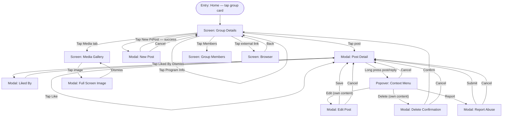

**ID:** UF-002
**Project:** roadscholar-mobile
**Epic:** E-002, E-006
**Persona:** Participant browsing groups and engaging in forum discussion
**Stage:** Ready
**Version:** 1.0
**Created:** 2026-03-28
**Updated:** 2026-03-28

---

# User Flow: Group Browsing & Discussion

## Overview

The core engagement loop: viewing trip groups on the home screen, entering a group to read threaded discussions, viewing trip program details, creating and editing posts, replying, liking, viewing the media gallery, and reporting content. Covers both the participant read path and the write path (new posts, replies, edits, deletes).

## Entry Point

Home screen → tap group card

## Stories Covered

S-002-001, S-002-002, S-002-003, S-002-004, S-002-005, S-002-006, S-002-007, S-002-008, S-002-009, S-006-001, S-006-002

## Flow

## Screens

### Group Details

**Purpose:** Primary group view. Shows the trip group's discussion forum, program summary, member list access, and media gallery tab. The hub screen for all group activity.

**Key content:**
- Group header: trip name, program number, dates, destination image
- Program summary section: activity level, pricing, trip description (S-006-001)
- Discussion thread list: post previews with author avatar, name, timestamp, like count, reply count
- Tab or section navigation: Discussion / Media / Members
- "New Post" action button
- External links to Road Scholar program pages (open in in-app browser)

**Primary action:** Tap post preview → Post Detail modal

**Transitions:**
- Tap post → Post Detail modal
- Tap New Post → New Post modal
- Tap Media tab → Media Gallery screen
- Tap Members → Group Members screen
- Tap external link → Browser screen

**Stories covered:** S-002-002, S-006-001

---

### Post Detail (Modal)

**Purpose:** Full view of a single post with all replies threaded beneath it. Supports all interaction actions: like, reply, edit, delete, report.

**Key content:**
- Post author avatar, name, timestamp
- Post body (text, @mentions, inline media thumbnails)
- Like button with optimistic UI and current like count
- "Liked By" count link (opens Liked By modal)
- Reply list (threaded, with same structure as post)
- Reply input field
- Long-press gesture on any post or reply → Context Menu popover

**Primary action:** Tap Reply field → compose and submit reply

**Transitions:**
- Tap Like → optimistic like toggle (same screen)
- Tap Liked By count → Liked By modal
- Long press post or reply → Context Menu popover
- Back / dismiss → Group Details screen

**Stories covered:** S-002-002, S-002-005, S-002-006, S-002-007, S-002-009

---

### New Post (Modal)

**Purpose:** Compose interface for creating a new top-level post in the group forum. Supports text, @mentions, and media attachment.

**Key content:**
- Text input area with @mention autocomplete
- Media attach button (photo / video — chunked upload on submit)
- Post button (disabled until content present)
- Cancel button

**Primary action:** Tap Post → submit and return to Group Details

**Transitions:**
- Post success → Group Details screen (new post appears in feed)
- Cancel → Group Details screen (no changes)

**Stories covered:** S-002-003, S-002-007

---

### Edit Post (Modal)

**Purpose:** Allows the author to modify the text body of their own post or reply. Accessed via the Context Menu.

**Key content:**
- Pre-populated text field with existing post body
- @mention autocomplete
- Save button
- Cancel button

**Primary action:** Tap Save → update post and return to Post Detail

**Transitions:**
- Save → Post Detail modal (updated content displayed)
- Cancel → Post Detail modal (no changes)

**Stories covered:** S-002-004

---

### Media Gallery

**Purpose:** Displays all media (photos and videos) shared across the group's forum in a grid layout. Provides a visual archive of shared trip content.

**Key content:**
- Grid of image/video thumbnails, newest first
- Video items show play icon overlay
- Empty state: "No photos or videos shared yet"

**Primary action:** Tap thumbnail → Full Screen Image modal

**Transitions:**
- Tap image/video → Full Screen Image modal
- Back → Group Details screen

**Stories covered:** S-002-008

---

### Group Members

**Purpose:** Lists all members of the trip group. Identifies group leaders with a badge. Supports participant discovery within the group.

**Key content:**
- Member list: avatar, display name, hometown (if set and not private)
- Group Leader badge on leader entries
- Member count header

**Primary action:** Browse / scroll list

**Transitions:**
- Back → Group Details screen

**Stories covered:** S-002-002

---

### Full Screen Image (Modal)

**Purpose:** Presents a single media item (photo or video) at full screen. Supports swipe to dismiss.

**Key content:**
- Full-screen image or video player
- Author name and timestamp overlay (bottom)
- Close / dismiss control

**Primary action:** Swipe down or tap close → dismiss

**Transitions:**
- Dismiss → Media Gallery screen

**Stories covered:** S-002-008

---

### Browser

**Purpose:** In-app browser for external links surfaced within group content (e.g., Road Scholar program pages, linked resources). Keeps the user in the app context.

**Key content:**
- Web view loading external URL
- Navigation controls: back, forward, reload
- URL bar (read-only display)
- Close / back button to return to app

**Primary action:** Browse external content

**Transitions:**
- Back / Close → Group Details screen (origin)

**Stories covered:** S-006-002

---

### Liked By (Modal)

**Purpose:** Shows the list of users who have liked a post. Provides social visibility into who engaged with content.

**Key content:**
- List of users: avatar and display name
- Like count header

**Primary action:** Dismiss

**Transitions:**
- Dismiss → Post Detail modal

**Stories covered:** S-002-006

---

### Context Menu (Popover)

**Purpose:** Long-press contextual action menu for a post or reply. Shows only actions relevant to the user's relationship to the content (own vs. others').

**Key content:**
- Edit (own content only)
- Delete (own content only)
- Report (others' content only)
- Cancel

**Primary action:** Select action → navigate to appropriate modal

**Transitions:**
- Edit → Edit Post modal
- Delete → Delete Confirmation modal
- Report → Report Abuse modal
- Cancel → Post Detail modal (no action)

**Stories covered:** S-002-004, S-002-009

---

### Delete Confirmation (Modal)

**Purpose:** Confirms the user's intent before permanently deleting a post or reply. Prevents accidental deletion.

**Key content:**
- Confirmation message ("Are you sure you want to delete this post?")
- "Delete" destructive button
- "Cancel" button

**Primary action:** Tap Delete → remove content and return to Group Details

**Transitions:**
- Confirm delete → Group Details screen (post removed from feed)
- Cancel → Post Detail modal

**Stories covered:** S-002-004

---

### Report Abuse (Modal)

**Purpose:** Allows a participant to flag inappropriate content for moderation review. Submits a report against a specific post or reply.

**Key content:**
- Reason selector or free-text field ("Why are you reporting this?")
- Submit button
- Cancel button

**Primary action:** Tap Submit → send report and return to Post Detail

**Transitions:**
- Submit → Post Detail modal (confirmation toast shown)
- Cancel → Post Detail modal

**Stories covered:** S-002-009

---

## Exit Points

| Exit | Destination |
|------|-------------|
| Back from Group Details | Home screen |
| Delete post confirmed | Group Details screen |
| Back from Browser | Group Details screen |

---

## Change Log

| Date | Version | Author | Change |
|------|---------|--------|--------|
| 2026-03-28 | 1.0 | — | Created |
| 2026-03-28 | 1.0 | — | Reverse-engineered from codebase — marks existing shipped functionality |
