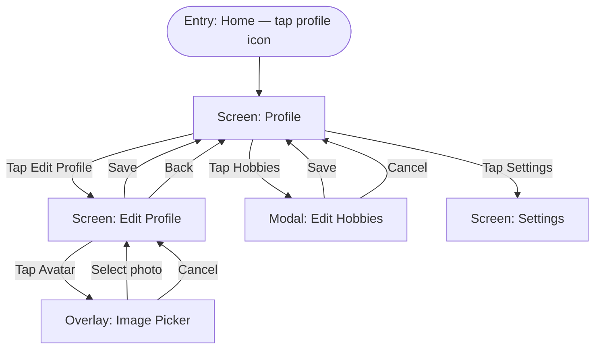

**ID:** UF-003
**Project:** roadscholar-mobile
**Epic:** E-003
**Persona:** Participant viewing and editing their profile
**Stage:** Ready
**Version:** 1.0
**Created:** 2026-03-28
**Updated:** 2026-03-28

---

# User Flow: Profile Management

## Overview

Covers viewing the user profile, editing profile details (name, bio, location, avatar), managing hobbies, and adjusting privacy settings for personal information visibility. Also covers the Settings screen reached from the profile.

## Entry Point

Home → tap profile icon / avatar

## Stories Covered

S-003-001, S-003-002, S-003-003, S-003-004

## Flow

## Screens

### Profile

**Purpose:** Displays the authenticated user's full profile. Serves as the identity hub — shows the user how their profile appears to other participants in groups they share.

**Key content:**
- Avatar photo
- Display name
- Hometown / location (if not hidden by privacy settings)
- Bio / about text
- Hobbies list
- "Edit Profile" button
- "Settings" link
- Privacy indicator (which fields are visible to other participants)

**Primary action:** Tap Edit Profile → Edit Profile screen

**Transitions:**
- Edit Profile → Edit Profile screen
- Hobbies → Edit Hobbies modal
- Settings → Settings screen

**Stories covered:** S-003-001

---

### Edit Profile

**Purpose:** Allows the participant to update their display name, bio, hometown, and avatar photo. Changes are saved back to the Verint user profile.

**Key content:**
- Avatar image with "Change Photo" tap target
- Display name field (editable)
- Hometown / location field
- Bio / about field (character limit)
- Save button
- Back / Cancel

**Primary action:** Tap Save → persist changes and return to Profile screen

**Transitions:**
- Tap Avatar → Image Picker overlay
- Save → Profile screen (updated data displayed)
- Back / Cancel → Profile screen (no changes)

**Stories covered:** S-003-002

---

### Edit Hobbies (Modal)

**Purpose:** Presents a selectable list of hobbies (interest tags) for the participant to choose from. Selections display on the profile and help fellow travelers find common ground.

**Key content:**
- List or grid of hobby options (checkboxes / toggle chips)
- Current selections pre-checked
- Save button
- Cancel button

**Primary action:** Tap Save → update hobby list and return to Profile screen

**Transitions:**
- Save → Profile screen (hobbies section updated)
- Cancel → Profile screen (no changes)

**Stories covered:** S-003-003

---

### Image Picker (Overlay)

**Purpose:** OS-level image picker for selecting or capturing a new avatar photo. Initiated from Edit Profile when the user taps their avatar.

**Key content:**
- Photo library browser (OS-provided)
- Camera option (if supported and permitted)
- Cancel option

**Primary action:** Select photo → return to Edit Profile with new image staged

**Transitions:**
- Select photo → Edit Profile screen (avatar preview updated, not yet saved)
- Cancel → Edit Profile screen (no change)

**Stories covered:** S-003-002

---

### Settings

**Purpose:** Application-level settings including notification preferences, privacy controls, and account actions. Reached from the Profile screen.

**Key content:**
- Notification preferences (push channels: posts, replies, mentions, likes — see UF-005)
- Privacy settings: show/hide hometown, bio, hobbies from other participants (S-003-004)
- Dark mode preference (light / dark / auto)
- App version display
- Sign Out action

**Primary action:** Adjust toggles and fields inline; changes save immediately

**Transitions:**
- Back → Profile screen

**Stories covered:** S-003-004

---

## Exit Points

| Exit | Destination |
|------|-------------|
| Back from Profile | Home screen |
| Back from Settings | Profile screen |
| Sign Out (from Settings) | Login screen |

---

## Change Log

| Date | Version | Author | Change |
|------|---------|--------|--------|
| 2026-03-28 | 1.0 | — | Created |
| 2026-03-28 | 1.0 | — | Reverse-engineered from codebase — marks existing shipped functionality |
