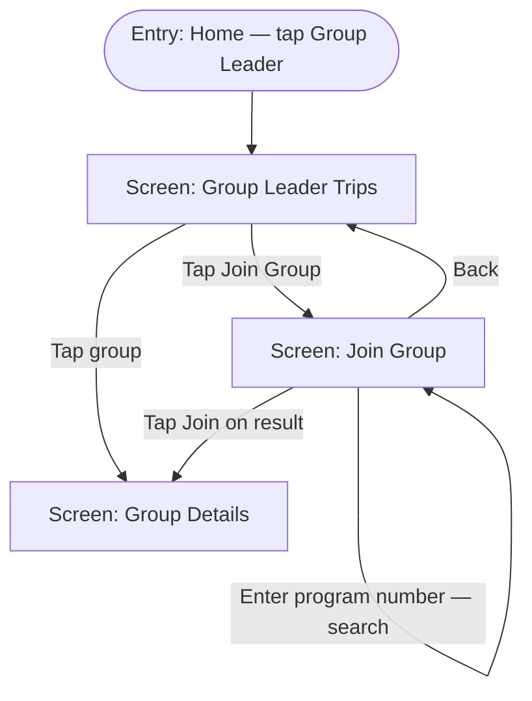

**ID:** UF-004
**Project:** roadscholar-mobile
**Epic:** E-004
**Persona:** Group leader finding and joining their assigned trip groups
**Stage:** Ready
**Version:** 1.0
**Created:** 2026-03-28
**Updated:** 2026-03-28

---

# User Flow: Group Leader Management

## Overview

Group leaders search for their trip groups by program number, join groups, and view all their assigned trips in one place. This flow covers the leader-specific entry point from the home screen, the program number search interface, the join action, and the resulting group view.

## Entry Point

Home → Group Leader menu

## Stories Covered

S-004-001, S-004-002

## Flow

## Screens

### Group Leader Trips

**Purpose:** Leader-specific landing screen listing all trip groups the authenticated leader has joined. Provides a single view for leaders managing multiple trips. Shows leader badge context and quick access to each group's discussion.

**Key content:**
- List of joined groups: trip name, program number, destination, trip dates
- Group Leader badge on each card
- "Join Group" button to add a new group by program number
- Empty state: "You haven't joined any groups yet. Use Join Group to find your trip."

**Primary action:** Tap group card → Group Details screen

**Transitions:**
- Tap group card → Group Details screen (cross-ref to UF-002)
- Tap Join Group → Join Group screen
- Back → Home screen

**Stories covered:** S-004-002

---

### Join Group

**Purpose:** Allows a group leader to search for a specific trip group by entering its Road Scholar program number. Returns a matching group result for the leader to join. This is the mechanism for leaders to self-serve their group access.

**Key content:**
- Program number input field (numeric keyboard)
- Search / Find button
- Search result card: trip name, program number, destination, dates
- "Join" button on result card
- No-result state: "No group found for that program number. Please check the number and try again."
- Back button

**Primary action:** Enter program number → tap Search → tap Join on result → enter Group Details

**Transitions:**
- Tap Search / enter program number → search result displayed (same screen)
- Tap Join on result → Group Details screen (cross-ref to UF-002; leader is now a member)
- Back → Group Leader Trips screen

**Stories covered:** S-004-001

---

### Group Details

**Purpose:** Standard group detail view — same screen as in UF-002, now entered via the leader path. The leader has the same discussion and media access as a participant, plus their Group Leader badge is visible to other members.

**Key content:** (see UF-002 — Group Details)

**Primary action:** (see UF-002)

**Transitions:**
- Back → Group Leader Trips screen (when entered from this flow)

**Stories covered:** S-004-001, S-004-002

---

## Exit Points

| Exit | Destination |
|------|-------------|
| Back from Group Leader Trips | Home screen |
| Back from Join Group | Group Leader Trips screen |
| Back from Group Details (leader path) | Group Leader Trips screen |

---

## Change Log

| Date | Version | Author | Change |
|------|---------|--------|--------|
| 2026-03-28 | 1.0 | — | Created |
| 2026-03-28 | 1.0 | — | Reverse-engineered from codebase — marks existing shipped functionality |
