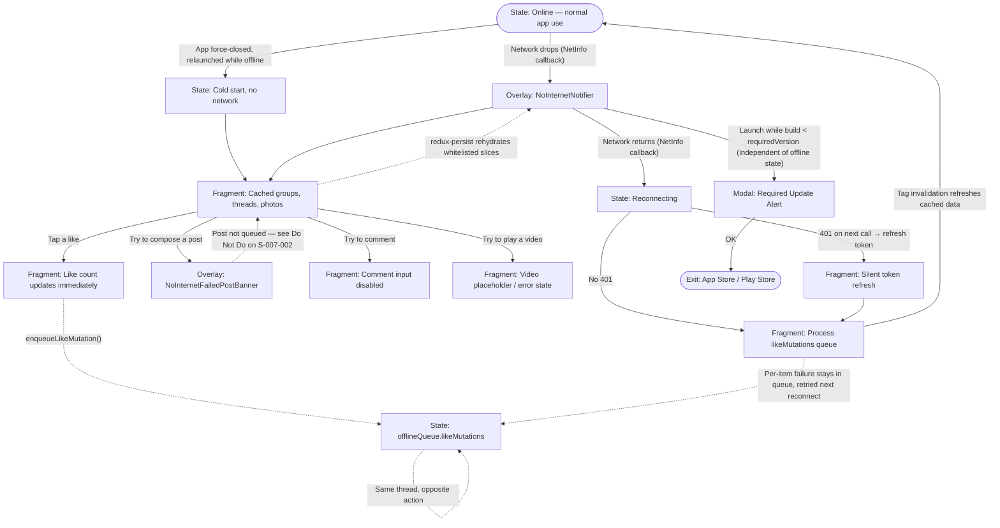

**ID:** UF-005
**Project:** roadscholar-mobile
**Epic:** E-007
**Persona:** Participant on a trip with intermittent or absent connectivity (national park, international destination, motorcoach in transit)
**Stage:** Ready
**Version:** 1.0
**Created:** 2026-05-22
**Updated:** 2026-05-22

---

# User Flow: Offline & Reliability

## Overview

This is a **cross-cutting system flow** rather than a screen sequence. It describes how the app behaves when connectivity drops, how the participant can still read and lightly engage with cached content, what is blocked vs queued vs failed-fast, and how the app recovers when connectivity returns — including the path back through an expired-while-offline access token.

The flow exists because the four E-007 stories ([S-007-001 Offline Data Caching](../epics/E-007-offline-reliability/S-007-001-offline-data-caching.md), [S-007-002 Offline Like Queue](../epics/E-007-offline-reliability/S-007-002-offline-like-queue.md), [S-007-003 Network Status & Recovery](../epics/E-007-offline-reliability/S-007-003-network-status-recovery.md), [S-007-004 Forced Update Check](../epics/E-007-offline-reliability/S-007-004-forced-update-check.md)) collectively form a single user-perceptible behavior — losing the network and getting it back. Documenting them as one flow lets a single TF cover the cross-story interactions that no individual T-007-* plan can catch.

This flow shares no screens with UF-001/002/003/004 — the offline banner and the failed-post banner are overlays that ride on top of every screen those flows define.

## Entry Point

Any authenticated session reaching a state where `netInfo.isConnected` transitions to `false`. The flow also covers the cold-start case where the app launches into an already-offline state.

## Stories Covered

S-007-001, S-007-002, S-007-003, S-007-004

## Flow

## Screens

### Overlay: NoInternetNotifier

**Purpose:** Persistent banner that surfaces on **every** authenticated screen the moment `netInfo.isConnected === false`. The participant sees the same banner whether they are on Home, a Group thread, the Gallery, Profile, or Settings — there is no "main screen only" rule. This was the explicit fix in RSS-410.

**Key content:**
- "No internet connection" headline
- "Please connect to the internet to continue" body line
- No actions — purely informational; the banner dismisses itself when connectivity returns

**Primary action:** None (passive overlay).

**Transitions:**
- Auto-shows when `setConnectionStatus` fires with `isConnected: false`
- Auto-dismisses when `setConnectionStatus` fires with `isConnected: true`

**Stories covered:** S-007-003

---

### Overlay: NoInternetFailedPostBanner

**Purpose:** Variant of the offline banner that surfaces specifically on the post-compose surface when a post attempt fails because the device is offline. Conveys that the failure is recoverable (the upload will retry on reconnect for the queued-media path) rather than a generic API error.

**Key content:**
- "No internet connection" headline
- "Failed posts will be reattempted" body line

**Primary action:** None — the [UploadingPostsNotifier](../reference/design/screens/DS-home.md) component owns the retry affordance once connectivity returns.

**Transitions:**
- Shows when a post submission is attempted while offline
- Auto-dismisses when connectivity returns

**Stories covered:** S-007-002, S-007-003

---

### Fragment: Cached groups, threads, photos

**Purpose:** Same Home / Group Details / Gallery surfaces as defined in UF-002, but populated from the RTK Query cache that redux-persist rehydrates on cold start. No visual difference from the online versions — no watermark, no "(cached)" tag.

**Key content:**
- Group list (Home), discussion threads (Group Details), photo gallery (Gallery) — all reading from the persisted `api` slice
- Profile pages of any participant the user viewed while online

**Primary action:** Same reading affordances as the online flow.

**Transitions:**
- Like → OptimisticLike (queued, see below)
- Tap compose → PostFails
- Tap comment input → CommentBlocked
- Tap video → VideoPlaceholder

**Stories covered:** S-007-001

---

### Fragment: Like count updates immediately (optimistic)

**Purpose:** When a participant likes or unlikes content while offline, the UI updates instantly (count change + filled-heart state) and the mutation is appended to `offlineQueue.likeMutations`. The participant cannot tell from the UI whether they are online or offline at the moment of the tap — that is by design.

**Key content:**
- Heart icon transitions to filled / unfilled
- Like count increments / decrements

**Primary action:** Tap heart again to toggle (queued as a second mutation; the dedup logic in `enqueueLikeMutation` keeps only the latest per-thread action).

**Transitions:**
- Enqueues into `offlineQueue.likeMutations` via the same mutation function used online
- On reconnect, ProcessQueue drains the queue

**Stories covered:** S-007-002

---

### Fragment: Comment input disabled

**Purpose:** Commenting requires live connectivity. When offline, the comment input on Group Details / Post Detail is either disabled or replaced with an inline offline message. This is the explicit `Do Not Do` in S-007-002 (comments are not queued).

**Key content:**
- Comment text input visually disabled (greyed out)
- Optional inline message: "Comments unavailable while offline"

**Primary action:** None while offline.

**Transitions:**
- Re-enables automatically when connectivity returns

**Stories covered:** S-007-002

---

### Fragment: Video placeholder / error state

**Purpose:** Photos in the gallery are cached for offline viewing; videos are stream-only and **not** cached. When a participant taps a video while offline, the player shows a placeholder or error rather than crashing or hanging.

**Key content:**
- Video thumbnail still visible (it was cached as an image)
- Tap → error state ("Video unavailable offline") instead of player

**Primary action:** None while offline.

**Stories covered:** S-007-001

---

### State: Reconnecting

**Purpose:** Transition state when `netInfo.isConnected` flips back to `true`. The listener middleware in `src/redux/store.ts` runs on this transition only (it tracks `previousConnectionState`), so the recovery work happens exactly once per reconnect — not every time a `setConnectionStatus` action fires.

**Key content:**
- No dedicated UI; the NoInternetNotifier dismisses, in-progress upload notifiers retry, queued likes process
- This is a logical state, not a screen

**Primary action:** None — fully automatic.

**Transitions:**
- TokenRefresh (if the next API call returns 401)
- ProcessQueue (likes drain in the order they were enqueued, latest-per-thread only)
- Tag invalidation refreshes whatever the user is currently viewing

**Stories covered:** S-007-003, S-007-004

---

### Fragment: Silent token refresh

**Purpose:** If the access token expired while the device was offline, the first authenticated request after reconnect will fail with 401. `tryRequestingAccessTokenIfTokenIssue` in `src/api/apiSlice.ts` runs once (deduplicated via `refreshTokenPromise`) and the original request is retried with the new token. The participant never sees a login screen for an expired-while-offline token. This was the explicit fix in RSS-437.

**Key content:**
- No UI — the participant sees the previously-blank screen populate as the retried request succeeds
- If refresh itself fails (refresh token also expired), the app routes to Login (signOut() dispatches)

**Primary action:** None — fully automatic.

**Stories covered:** S-007-004

---

### Fragment: Process likeMutations queue

**Purpose:** When the listener middleware sees `previousConnectionState === false && isConnected === true`, it iterates `offlineQueue.likeMutations` and dispatches each via the appropriate `likeThread` or `unlikeThread` endpoint. Successful items dequeue; failed items stay queued and retry on the next reconnect.

**Key content:**
- No dedicated UI — the participant sees their queued likes "stick" to the server (e.g., reload-resilient)
- Failure surfaces only if a queued like is dropped by the server (e.g., 410 Gone on a deleted thread) — see Open Questions in TF-005

**Primary action:** None — fully automatic.

**Stories covered:** S-007-002

---

### Modal: Required Update Alert

**Purpose:** Independent of the offline state, on every cold launch [`checkVersion()`](../epics/E-007-offline-reliability/S-007-004-forced-update-check.md) fetches `VERSION_INFO_URL`. If the JSON's `requiredVersion` is newer than the build, this native `Alert` is shown with `requiredText`. The OK button opens the app store and re-presents the alert on return — there is no dismiss.

**Key content:**
- Title: "Update required"
- Body: `requiredText` from the JSON
- Single OK button → opens App Store / Play Store → re-presents on app foreground

**Primary action:** OK → external store. There is no Cancel.

**Transitions:**
- Exit: App Store / Play Store (OS-level handoff)

**Stories covered:** S-007-004

---

## Exit Points

| Exit | Destination |
|------|-------------|
| Connectivity returns mid-session | Normal online state (banner dismissed, queue drained) |
| Connectivity returns after token expiry | Normal online state with fresh access token (no login screen) |
| Required-update alert OK | App Store / Play Store (OS handoff; alert re-presents on return) |
| Refresh token also expired | Login (signOut dispatched) |

---

## Change Log

| Date | Version | Author | Change |
|------|---------|--------|--------|
| 2026-05-22 | 1.0 | PM Agent | Created — backfills the E-007 epic with a journey-style flow doc so an evergreen TF-005 plan can cover the cross-story behavior (RSS-403, RSS-410, RSS-437) that no individual T-007-* plan re-runs at the flow level. Reverse-engineered from `src/slices/netInfoSlice.ts`, `src/redux/store.ts`, `src/api/apiSlice.ts`, `src/utils/version.ts`, `src/components/NoInternetNotifier`, `src/components/NoInternetFailedPostBanner`, `src/components/UploadingPostsNotifier`. |
