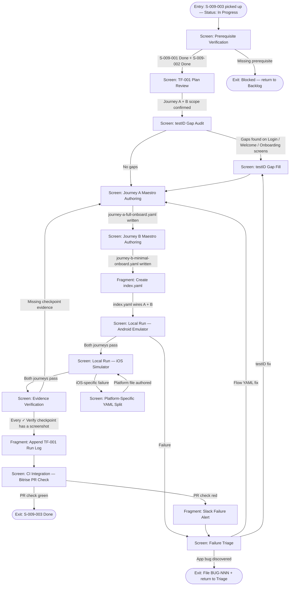

**ID:** UF-006
**Project:** roadscholar-mobile
**Epic:** E-009
**Persona:** QA agent implementing and executing the login flow regression suite
**Stage:** Ready
**Version:** 1.0
**Created:** 2026-06-05
**Updated:** 2026-06-05

---

# User Flow: QA Login Regression — Implement & Execute TF-001

## Overview

Covers the QA agent's end-to-end journey for S-009-003: verifying prerequisites (Maestro scaffolding from S-009-001, test accounts from S-009-002), authoring Maestro YAML for TF-001 Journey A (fresh-install full onboard) and Journey B (minimal-onboard fast track), filling testID gaps in the codebase, running locally on both platforms, capturing evidence at every checkpoint, and appending the first successful run log to TF-001. Also covers the downstream CI integration (S-009-004) and failure alerting (S-009-005) that wire the suite into the PR workflow.

All journeys target the **new native login screen from S-010-004** — no Salesforce SSO web view, no OAuth redirect, no in-app browser.

## Entry Point

QA agent picks up S-009-003 from Backlog (Status: In Progress)

## Stories Covered

S-009-003, S-009-001, S-009-002, S-009-004, S-009-005

## Flow

## Screens

### Screen: Prerequisite Verification

**Purpose:** QA agent confirms that both hard prerequisites for S-009-003 are Done before starting implementation. Without these, authoring Maestro flows would fail on missing scaffolding or missing test accounts.

**Key content:**
- S-009-001 status check — Maestro project structure exists (`maestro/`), shared primitives (`login.yaml`, `reach-home.yaml`), testID convention documented, lint rule active
- S-009-002 status check — `rs-test-fresh-participant` and `rs-test-returning-participant` accounts provisioned, credentials in 1Password, baseline state recorded in `qa-testplan.md`
- S-010-004 status check — native login screen shipped (hard blocker per P-003-02 sequencing)

**Primary action:** Verify all three prerequisites are Done → proceed to TF-001 Plan Review

**Transitions:**
- All prerequisites Done → TF-001 Plan Review
- Any prerequisite incomplete → Blocked (return to Backlog)

**Stories covered:** S-009-001, S-009-002

---

### Screen: TF-001 Plan Review

**Purpose:** QA agent reads `qa/TF-001-login-onboarding.md` to understand exactly which journeys are in scope for this story (A + B only) and what each journey's checkpoints require.

**Key content:**
- Journey A — Fresh-install, full onboard: 23 steps, 12 `✓ Verify` checkpoints
- Journey B — Fresh-install, minimal-onboard fast track: 11 steps, 7 `✓ Verify` checkpoints
- Maestro implementation notes (one flow per journey, shared setup via `runFlow`, evidence capture convention)
- Explicit exclusion: Journey C / D / E deferred to S-009-017

**Primary action:** Confirm Journey A + B scope → proceed to testID audit

**Transitions:**
- Scope confirmed → testID Gap Audit

**Stories covered:** S-009-003

---

### Screen: testID Gap Audit

**Purpose:** Cross-reference the testID audit from S-009-001 against the screens Journey A + B exercise (native Login, Welcome, Onboarding Setup, Push Notification Permission, Onboarding Complete, Home). Flag any elements referenced in the TF-001 plan that lack a testID.

**Key content:**
- testID audit output from S-009-001 (the documented gaps)
- Screen-by-screen gap list: Login (Sign In button, email field, password field — all new in S-010-004), Welcome (greeting text, hero image), Onboarding Setup (avatar, display name, hometown, bio, skip, save), Push Notification (allow, not now), Onboarding Complete (get started), Home (trip group list)
- Convention check: testIDs follow documented naming from S-009-001

**Primary action:** Identify gaps → proceed to Gap Fill (or skip if none)

**Transitions:**
- Gaps found → testID Gap Fill
- No gaps → Journey A Maestro Authoring

**Stories covered:** S-009-003, S-009-001

---

### Screen: testID Gap Fill

**Purpose:** Add missing testIDs to the codebase's `src/` files for every element referenced by Journey A + B Maestro flows. This is the first real load-test of the S-009-001 audit.

**Key content:**
- Per-screen diff: which components need `testID` props added
- Native Login screen (S-010-004) — likely needs fresh testIDs since this screen is new
- Convention: `testID="screen-element"` format per S-009-001 documentation

**Primary action:** Add testIDs → commit → proceed to Journey A authoring

**Transitions:**
- testIDs added → Journey A Maestro Authoring

**Stories covered:** S-009-003

---

### Screen: Journey A Maestro Authoring

**Purpose:** Author `maestro/flows/tf-001/journey-a-full-onboard.yaml` — the full happy path from cold launch through native login, welcome, onboarding with all fields, push permission grant, to Home with trip group visible.

**Key content:**
- YAML structure: uses `runFlow: setup-fresh-install.yaml` for shared setup
- Step-by-step translation of TF-001 Journey A's 23 steps into Maestro commands
- `take-evidence.yaml` invoked at every `✓ Verify` checkpoint (12 evidence captures)
- **Native login flow** — `tapOn: testID="login-email"`, enter credentials, `tapOn: testID="login-sign-in"` — no web view interaction, no OAuth redirect handling
- TC-009-003-004 assertion: verify no web view appears at any point (assertNotVisible on web view container)

**Primary action:** Write + save `journey-a-full-onboard.yaml` → proceed to Journey B

**Transitions:**
- YAML written → Journey B Maestro Authoring

**Stories covered:** S-009-003

---

### Screen: Journey B Maestro Authoring

**Purpose:** Author `maestro/flows/tf-001/journey-b-minimal-onboard.yaml` — the skip-everything fast track. Same native login entry as Journey A, but skips every optional onboarding field.

**Key content:**
- YAML structure: reuses `runFlow: setup-fresh-install.yaml` + login steps from Journey A
- Minimal path: Login → native Sign In → Welcome → Onboarding Setup → tap Skip → Push Notification → tap Not Now → Onboarding Complete → Home
- TC-009-003-005 assertion: Home renders with bare-minimum profile, no blocking errors
- 7 evidence captures at `✓ Verify` checkpoints

**Primary action:** Write + save `journey-b-minimal-onboard.yaml` → proceed to index creation

**Transitions:**
- YAML written → Create index.yaml

**Stories covered:** S-009-003

---

### Fragment: Create index.yaml

**Parent:** Journey B Maestro Authoring (follows immediately)

**Purpose:** Create `maestro/flows/tf-001/index.yaml` that invokes both happy-path journeys in sequence as the full TF-001 R-003 run.

**Key content:**
- `runFlow: journey-a-full-onboard.yaml`
- `runFlow: journey-b-minimal-onboard.yaml`
- Entry point for `yarn test:e2e:tf-001`

**Stories covered:** S-009-003

---

### Screen: Local Run — Android Emulator

**Purpose:** Execute `yarn test:e2e:tf-001` against the Android emulator on a clean RC build with `rs-test-fresh-participant` at baseline. First end-to-end validation that the authored flows work.

**Key content:**
- Clean RC build loaded on Android emulator
- Test account `rs-test-fresh-participant` reset to baseline (S-009-002)
- Maestro CLI output: step-by-step pass/fail for both journeys
- Evidence directory populating at `evidence/tf-001/journey-a/` and `evidence/tf-001/journey-b/`
- TC-009-003-001: both Journey A + B pass end-to-end on first run

**Primary action:** Run suite → inspect results

**Transitions:**
- Both journeys pass → Local Run — iOS Simulator
- Any failure → Failure Triage

**Stories covered:** S-009-003

---

### Screen: Local Run — iOS Simulator

**Purpose:** Execute the same `yarn test:e2e:tf-001` against iOS simulator. Any iOS-specific behavior must live in a platform-suffixed file, not as a runtime branch (TC-009-003-002).

**Key content:**
- Same RC build on iOS simulator
- Same test account at baseline
- TC-009-003-002: both journeys pass; iOS-specific behavior in `journey-X-ios.yaml` only

**Primary action:** Run suite → inspect results

**Transitions:**
- Both journeys pass → Evidence Verification
- iOS-specific failure → Platform-Specific YAML Split

**Stories covered:** S-009-003

---

### Screen: Platform-Specific YAML Split

**Purpose:** When iOS behavior diverges from Android (e.g., push permission dialog rendering, biometric prompt differences), extract the divergent steps into `journey-a-ios.yaml` or `journey-b-ios.yaml`.

**Key content:**
- Identify the divergent step(s)
- Extract into platform-suffixed YAML
- Keep shared steps in the base flow
- Re-run iOS to confirm the split resolves the failure

**Primary action:** Author platform-specific YAML → re-run iOS

**Transitions:**
- Platform file authored → Local Run — iOS Simulator (re-run)

**Stories covered:** S-009-003

---

### Screen: Evidence Verification

**Purpose:** Inspect `evidence/tf-001/journey-a/` and `evidence/tf-001/journey-b/` to confirm every `✓ Verify` checkpoint from TF-001 has a corresponding screenshot (TC-009-003-003).

**Key content:**
- Journey A: 12 checkpoints → 12 screenshots expected
- Journey B: 7 checkpoints → 7 screenshots expected
- Screenshot naming matches checkpoint numbering
- Visual spot-check: screenshots show the expected screen state

**Primary action:** Confirm full evidence coverage → proceed to Run Log

**Transitions:**
- All checkpoints covered → Append TF-001 Run Log
- Missing checkpoint evidence → Journey A Maestro Authoring (add missing `take-evidence` call)

**Stories covered:** S-009-003

---

### Screen: Failure Triage

**Purpose:** When a journey fails on either platform, diagnose the root cause using the Maestro report + evidence + device log tail (TC-009-003-006).

**Key content:**
- Failed step identification
- Assertion that didn't match
- Screenshot at failure point
- Device log tail
- Root cause classification: flow YAML error, missing/wrong testID, or genuine app bug

**Primary action:** Classify root cause → route to fix

**Transitions:**
- Flow YAML fix needed → Journey A Maestro Authoring (or Journey B)
- testID fix needed → testID Gap Fill
- App bug discovered → File BUG-NNN, return to Triage after fix ships

**Stories covered:** S-009-003

---

### Fragment: Append TF-001 Run Log

**Parent:** Evidence Verification

**Purpose:** Append the first successful end-to-end run row to the Run Log table in `qa/TF-001-login-onboarding.md` (TC-009-003-007).

**Key content:**
- Run date, build/commit, trigger (manual — first run), result (Pass), notes
- This is the formal signal that TF-001 Journey A + B are operational

**Stories covered:** S-009-003

---

### Screen: CI Integration — Bitrise PR Check

**Purpose:** Verify the authored flows run correctly in the Bitrise PR-trigger pipeline (S-009-004). A PR opened against the repo triggers a Maestro run; the result surfaces as a GitHub PR check.

**Key content:**
- Bitrise `pr-e2e` workflow triggers on PR open/update
- Builds the app from the PR branch
- Runs `yarn test:e2e:tf-001` against the built artifact
- GitHub PR check shows green/red
- Evidence artifacts attached to the Bitrise build

**Primary action:** Open a test PR → verify the check runs and passes

**Transitions:**
- PR check green → S-009-003 Done
- PR check red → Slack Failure Alert → Failure Triage

**Stories covered:** S-009-004

---

### Fragment: Slack Failure Alert

**Parent:** CI Integration — Bitrise PR Check

**Purpose:** When a CI run goes red, a Slack message posts to the QA channel (S-009-005) with the failed flow, build info, evidence link, and Bitrise log link.

**Key content:**
- Channel: #qa or configured QA channel
- Message: which flow failed, on which build, link to evidence, link to Bitrise log
- Fires on failure only (not on success)

**Stories covered:** S-009-005

---

## Exit Points

| Exit | Destination |
|------|-------------|
| S-009-003 Done — both journeys pass on both platforms, evidence complete, run log appended, CI green | Story moves to Status: QA → In Review → Done |
| Blocked — prerequisite incomplete | Story returns to Backlog until S-009-001, S-009-002, or S-010-004 ships |
| App bug discovered during triage | BUG-NNN filed; story paused until fix lands |

---

## Change Log

| Date | Version | Author | Change |
|------|---------|--------|--------|
| 2026-06-05 | 1.0 | PM Agent | Created — QA agent process flow for implementing TF-001 Journey A + B as Maestro flows. Covers S-009-003 (central), S-009-001/002 (prerequisites), S-009-004/005 (CI + alerting). All journeys target native login from S-010-004 (no SSO web view). |
