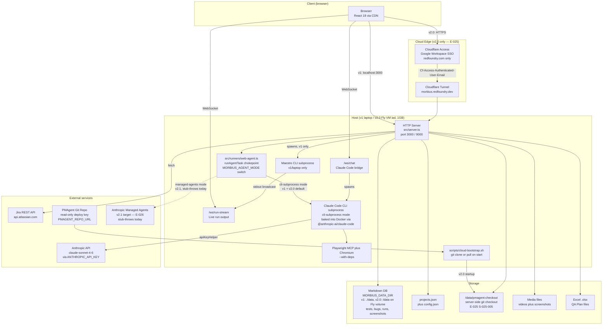
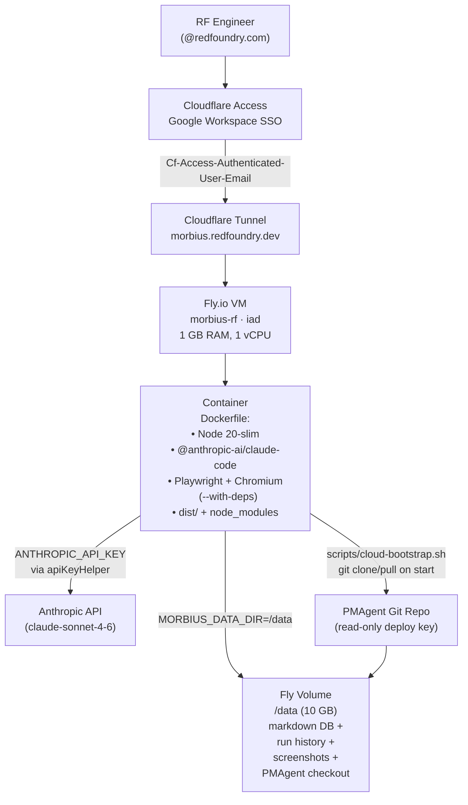

# Architecture: Morbius

**Project:** morbius
**Version:** 1.3
**Updated:** 2026-04-30

---

## Stack

| Layer | Technology | Notes |
|-------|-----------|-------|
| Runtime | Node.js ≥18, TypeScript 5.7 (ES2022/NodeNext) | ESM modules throughout |
| HTTP Server | `node:http` (stdlib) | No Express — raw HTTP handler |
| WebSocket | `ws` 8.20 | Two WS servers multiplexed on same HTTP server |
| CLI | `commander` 12.1 | Entry point: `src/index.ts` |
| Frontend | React 18.3.1 + Babel Standalone 7.29 (CDN) | No build step — embedded in template literal in `src/server.ts` |
| Database | Markdown files + YAML frontmatter | `gray-matter` 4.0 for parse/write; `js-yaml` 4.1 for YAML config files |
| Excel sync | `xlsx` 0.18.5 | Import and export test cases to/from `.xlsx` |
| Fuzzy search | `fuse.js` 7.0 | ⌘K global search across tests, bugs, flows |
| Markdown rendering | `marked` 12.0 | Renders test case steps/criteria in detail panels |
| Build | `tsc` only | Output to `dist/`; `ts-node` for dev mode |

---

## System Architecture



**Legend:** Solid lines are live in v1 + v2.0. Dotted line (`WebRunner → ManagedAgents`) is the v2.1 path — currently a stub-throws mode at `src/runners/web-agent.ts`, flips live in E-026 after the browser-locality spike (S-026-002). The "Cloud Edge" subgraph applies only when accessed via `morbius.redfoundry.dev`; local laptop bypasses it.

---

## Key Components

### HTTP Server (`src/server.ts`)

Single file handling everything: HTTP routes, WebSocket upgrade, HTML generation, and all business logic. No framework.

**Routes:**

| Method | Path | What it does |
|--------|------|-------------|
| GET | `/` | Serves embedded dashboard HTML (~1MB) |
| GET | `/api/tests` | All test cases for active project |
| GET | `/api/bugs` | All bugs |
| GET | `/api/categories` | Category list with counts |
| GET | `/api/runs` | Run history |
| GET | `/api/dashboard` | Aggregated health data |
| GET | `/api/test/:id` | Single test case detail |
| GET | `/api/bug/:id` | Single bug detail |
| GET | `/api/maestro-tests` | List YAML flows from configured paths |
| GET | `/api/coverage` | Calculator field coverage matrix |
| GET | `/api/appmap` | App navigation Mermaid chart |
| GET | `/api/projects` | All registered projects |
| GET | `/api/device-matrix` | Device × test status grid |
| GET | `/screenshots/:path` | Serve bug screenshots from `data/` |
| GET | `/media/:path` | Serve run media from `mediaPath` (outside repo) |
| POST | `/api/test/update` | Update test status/notes + write changelog |
| POST | `/api/test/reorder` | Reorder cards within a category |
| POST | `/api/test/run` | Spawn Maestro flow directly |
| POST | `/api/test/run-mcp` | Spawn Maestro via Claude Code → MCP |
| POST | `/api/flow/run` | Run YAML flow by path |
| POST | `/api/bug/update` | Update bug status/notes + write changelog; if bug has `jiraKey`, fires Jira write-back (status/priority/notes/screenshot) — failures self-enqueue in replay queue (S-013-003) |
| POST | `/api/bugs/create` | Create new bug ticket |
| POST | `/api/bugs/:id/sync-jira` | Sync bug status with Jira (typed error codes; retries 3× with exponential backoff on transient failures — S-013-001) |
| POST | `/api/bugs/sync-all` | Bulk sync all bugs with Jira; awaited synchronously, returns per-bug `{id, ok, code?, message?}` (S-013-001) |
| POST | `/api/bugs/:id/create-jira` | Create Jira issue from local bug |
| GET  | `/api/jira/errors` | Last 20 Jira sync errors (ring buffer) — typed `code`, `status`, `attempt`, `bugId` per entry (S-013-001) |
| GET  | `/api/jira/health` | Aggregated sync health: `status` (healthy/degraded/broken/unconfigured), last success/error, queue + stuck counts, last 5 errors, suggested remediation (S-013-002) |
| GET  | `/api/jira/queue` | Per-project replay queue + attachment hashes from `data/{projectId}/jira-sync-state.json` (S-013-004) |
| POST | `/api/jira/queue/replay` | Force an immediate replay-tick (manual "Sync now") (S-013-004) |
| POST | `/api/jira/queue/:id/retry` | Manual retry of a single queued item; on success it's removed (S-013-004) |
| POST | `/api/jira/queue/:id/discard` | Drop a queued item (e.g. a stuck one that won't recover) (S-013-004) |
| POST | `/api/projects/switch` | Change active project |
| POST | `/api/projects/create` | Create new project |
| POST | `/api/config/update` | Save project config (paths, devices, Jira) |
| POST | `/api/excel/import` | Import an `.xlsx` (raw octet-stream body) into the active project — parses + writes markdown + sync-meta |
| POST | `/api/excel/preview` | Parse an `.xlsx` and return categories, total test cases, sample rows, skipped sheets — **does not write to disk** (S-014-002) |
| POST | `/api/runs/ingest-latest` | Parse latest Maestro output |
| GET  | `/api/healing` | List proposals (?state= filter optional). Default: all states; UI filters to validated by default (E-017 / S-017-005) |
| GET  | `/api/healing/:id` | Single proposal + inlined hierarchy snapshot text (E-017) |
| POST | `/api/healing/propose` | Manual trigger — kicks the snapshot → Claude → validate pipeline (E-017 / S-017-001) |
| POST | `/api/healing/:id/modify` | Save a human-edited selector before approval (E-017 / S-017-005) |
| POST | `/api/healing/:id/approve` | Mark approved + atomically write the YAML via `replaceSelector(flowPath,old,new)` from `maestro-yaml.ts`. Disk failure preserves `approved` state for retry (E-017 / S-017-006) |
| POST | `/api/healing/:id/reject` | Mark rejected (E-017 / S-017-005) |
| GET | `/api/bug/:id/impact` | Cached impact analysis for a bug — also returns last-3 generation errors for that bug (E-016 / S-016-002) |
| POST | `/api/bug/:id/impact/generate` | Trigger Claude impact analysis. Preserves prior `impact.md` on failure. Live tested ~9s end-to-end (E-016 / S-016-002) |
| POST | `/api/bug/:id/impact/flag` | Toggle a "not relevant" flag on a related-test row. Sidecar `bugs/{bugId}/impact-flags.json` (E-016 / S-016-005) |
| GET  | `/api/bug/:id/impact/flags` | Read flag list for a bug (E-016 / S-016-005) |
| POST | `/api/webhook/jira` | Jira webhook — on issue status change, calls `triggerImpactRegen()` (60s dedupe). Polling fallback in `syncBugFromJira()` covers webhook outages (E-013, E-016 / S-016-003) |
| GET | `/api/jira/health` | Jira sync health status — last sync, error log, queue count (E-013) |
| GET | `/api/sheets/status` | Google Sheets connection + sync status (E-019) |
| POST | `/api/sheets/bind` | Bind a Sheet ID to the active project (E-019) |
| POST | `/api/sheets/sync` | Manual pull from Google Sheets (E-019) |
| GET | `/api/automation-candidates` | AppMap automation candidates for active project (E-018) |
| POST | `/api/automation-candidates/generate` | Trigger Claude candidate generation (E-018) |

### WebSocket Servers

**`/ws/chat`** — Claude Code bridge
- Client sends: `{ message: "ask claude something" }`
- Server spawns: `claude --print --model claude-sonnet-4-6 "<message>"`
- Server streams: `{ type: "chunk" | "info" | "done" | "error", content: "..." }`
- Timeout: 120 seconds; process killed on WS close

**`/ws/run-stream`** — Live test run output
- Client sends: `{ type: "subscribe", runId: "run-034" }`
- Server broadcasts step events from Maestro stdout to all subscribers
- Used by Maestro tab for live test execution progress

### Parsers (`src/parsers/`)

| File | Responsibility |
|------|---------------|
| `markdown.ts` | Read/write test cases and bugs as frontmatter markdown; write changelog entries; load project registry and config |
| `excel.ts` | Parse `.xlsx` sheets → category folders + test markdown; sync changes back; maintain `.sync-meta.json` checksums |
| `maestro-yaml.ts` | Parse YAML → human-readable steps; detect fragile selectors; extract QA Plan ID; **add `replaceSelector(path, old, new)` for E-017** |
| `maestro-results.ts` | Parse Maestro CLI output (commands.json, status.json, report.xml) → TestRun records |
| `calculator-config.ts` | Parse `calculatorConfig.json` field tree; build coverage matrix vs YAML flows and test markdown |
| `google-sheets.ts` *(E-019, new)* | Google Sheets API read/write; mirrors `excel.ts` surface — `importFromSheet(sheetId)`, `exportToSheet(sheetId)`, uses same row→markdown transformer |

### Analyzer (`src/analyzer.ts`)

| Function | What it does |
|----------|-------------|
| `calculateFlakiness(history, window=10)` | Score = transitions ÷ (window−1); 1.0 = perfectly alternating, 0.0 = always same |
| `detectFlakyTests(tests, runs, threshold=0.4)` | Returns tests with score ≥ threshold, sorted descending |
| `analyzeSelectors(yaml)` | Flags `point{}` taps, `sleep >3s`, `index:` selectors |
| `findCoverageGaps(tests)` | Flags: no maestroFlow, not run >7 days, device coverage <50% |
| `buildActivityFeed(bugs, runs, limit=20)` | Recent events: bug_opened, test_failed, run_completed |

### Healing (`src/healing/`) *(E-017, new directory)*

| File | Responsibility |
|------|---------------|
| `selector-proposal.ts` | Full proposal lifecycle: enqueue HealingRequest, orchestrate snapshot → Claude proposal → validation run → write proposal markdown |
| `failure-classifier.ts` | Parse Maestro error output to determine if failure was a selector miss vs. assertion/crash/network |

### Generators (`src/generators/`)

| File | Responsibility |
|------|---------------|
| `maestro-flows.ts` | Generate complete Maestro YAML per calculator section; topological sort on `visibleIf` dependencies; pick test values from field ranges |
| `test-data.ts` | Select sensible test values: midpoint of expectedRange, first non-default singleSelect, etc. |
| `dependency-graph.ts` | Build field dependency map; count which option values trigger the most dependents |

---

## Data Model

### File Layout

```
data/
  projects.json                  ← { activeProject: "micro-air", projects: [...] }
  {projectId}/
    config.json                  ← ProjectConfig
    jira-sync-state.json         ← E-013: { lastSuccessAt, lastErrorAt, queue[], attachmentHashes{} } (S-013-001..004)
    automation-candidates.md     ← E-018: AppMap automation candidate list
    coverage-scan.md             ← E-020 (gated): legacy app coverage gap report
    regression-plan.md           ← E-021 (drift): per-project regression plan
    tests/
      {category-slug}/
        _category.yaml           ← { id, name, sheet, order }
        tc-{id}-{slug}.md        ← TestCase (frontmatter + markdown body)
    bugs/
      bug-{NNN}.md               ← Bug (frontmatter + markdown body)
      {bugId}/
        impact.md                ← E-016: BugImpact AI analysis (generated)
    runs/
      run-{id}.yaml              ← TestRun (pass/fail counts + per-test results)
    healing/
      proposal-{id}.md           ← E-017: SelectorProposal (generated + reviewed)
    screenshots/
      {bugId}/
        failure-{device}.png
```

### Key Types

```typescript
TestStatus  = 'pass' | 'fail' | 'flaky' | 'not-run' | 'in-progress'
Priority    = 'P1' | 'P2' | 'P3' | 'P4'
BugStatus   = 'open' | 'investigating' | 'fixed' | 'closed'
Platform    = 'ios' | 'android'

// E-016 — Bug-Impact AI
BugImpact = {
  bugId: string; generatedAt: string; bugStatus: BugStatus
  riskScore: number          // 0.0–1.0
  relatedTestsRerun: { testId: string; rationale: string }[]
  relatedTestsManual: { testId: string; rationale: string }[]
  reproNarrative: string
}

// E-017 — Self-Healing Selectors
HealingRequest = {
  id: string; flowPath: string; failedSelector: string
  failureStep: number; runId: string; status: 'pending' | 'snapshotted' | 'proposed' | 'validated' | 'invalidated' | 'approved' | 'rejected'
}
SelectorProposal = {
  id: string; requestId: string; proposedSelector: string
  confidence: number; rationale: string; lowConfidence: boolean
  status: 'validated' | 'invalidated' | 'approved' | 'rejected'
}

// E-018 — AppMap Automation Candidates
AutomationCandidate = {
  flowName: string; priority: 'P0' | 'P1' | 'P2'
  rationale: string; coverageStatus: 'covered' | 'partial' | 'none'
  expectedValueScore: number    // 0.0–1.0
}

// E-020 — Coverage Scan (gated)
CoverageScan = {
  generatedAt: string; appVersion: string; scanDurationMs: number
  coveredFlows: string[]; orphanedTests: string[]
  uncoveredHighRisk: { flow: string; priority: string }[]
}

// E-021 — Regression Plan (drift)
RegressionPlan = {
  schedule: string      // cron expression
  owners: string[]
  nextRun: string       // ISO datetime
}
```

### ProjectConfig fields

```typescript
{
  id: string           // slug (e.g. "micro-air")
  name: string
  excel?: { source: string }              // path to .xlsx
  maestro?: {
    androidPath: string                   // absolute path to Android flows
    iosPath: string                       // absolute path to iOS flows
    loginFlow?: string                    // shared login.yaml path
  }
  env?: Record<string, string>           // TEST_EMAIL, TEST_PASSWORD, etc.
  devices: Device[]
  appId?: string                         // bundle ID
  jira?: {
    cloudId: string
    projectKey: string
    jql?: string
    email?: string
    token: string
    baseUrl?: string
    webhookSecret?: string               // E-013 — Jira webhook HMAC verification
  }
  googleSheets?: {                       // E-019 — new
    refreshToken: string                 // encrypted at rest
    sheetId: string
    pollIntervalMinutes: number          // 5–60
    lastSyncAt?: string                  // ISO
  }
  healing?: {                            // E-017 — new
    enabled: boolean
    minConfidence: number                // proposals below this are low-confidence flagged
  }
  appMap?: string                        // Mermaid flowchart string
  mediaPath?: string                     // path outside repo for run videos
}
```

---

## Maestro CLI Integration

**Direct spawn** (run a flow by path):
```
spawn('maestro', ['test', flowPath], { env: { ...process.env, ...projectEnvVars } })
```

**Via Claude Code → MCP** (run with agent supervision):
```
spawn('claude', ['--print', '--model', 'claude-sonnet-4-6',
  'Run the Maestro flow at path "...". Use mcp__maestro__run_flow_files...'
])
```
Parses `{"status":"pass"}` or `{"status":"fail","error":"..."}` from the last line of Claude's output.

**Version check:**
```
execSync('maestro --version', { timeout: 5000 })
```

---

## Jira Integration

**Auth:** Basic auth (base64 `email:apiToken`) — Atlassian Cloud REST v3 standard. Single chokepoint: `jiraCall()` in `src/server.ts`.

**Endpoints used:**
```
GET  /rest/api/3/issue/{issueKey}                       ← read state for sync-jira
POST /rest/api/3/issue                                  ← create-jira
PUT  /rest/api/3/issue/{issueKey}                       ← write-back priority (S-013-003)
GET  /rest/api/3/issue/{issueKey}/transitions           ← discover transition IDs
POST /rest/api/3/issue/{issueKey}/transitions           ← write-back status (S-013-003)
POST /rest/api/3/issue/{issueKey}/comment               ← write-back notes as comment (S-013-003)
POST /rest/api/3/issue/{issueKey}/attachments           ← write-back screenshots, deduped by SHA-256 (S-013-003)
```

**Resilience (E-013):**
- Typed error codes: `AUTH` / `PERMISSION` / `NOT_FOUND` / `CONFLICT` / `RATE_LIMIT` / `SERVER` / `NETWORK` / `BAD_REQUEST` / `CONFIG`
- 3-attempt exponential backoff per call (only retries `RATE_LIMIT` / `SERVER` / `NETWORK`)
- Failed retryable calls auto-enqueue in `data/{projectId}/jira-sync-state.json`
- 60s background ticker replays the queue; items >10 attempts over 24h are marked `stuck` for manual action
- Last 20 errors readable at `GET /api/jira/errors`; aggregated state at `GET /api/jira/health`

**Fields synced (read-back):** summary, status, assignee, priority, labels, last comment, issue key, URL
**Fields written back (S-013-003):** status (via transition), priority (via PUT), notes → comment, screenshot → attachment

---

## Non-Functional Requirements

| Concern | Approach |
|---------|---------|
| Offline-first | All data lives in local markdown files — no network required to use the dashboard |
| No auth | Single-user local tool until Phase 7 (SaaS) |
| No database | Markdown files are the source of truth — human-readable and git-trackable |
| Hot reload | File system reads on every API call — no in-memory cache to invalidate |
| Port conflict | Configurable via `--port` flag or `PORT` env var |
| Process isolation | Maestro and Claude Code spawn as child processes; server stays up if they crash |

---

## Environment Variables

| Variable | Project | Purpose |
|----------|---------|---------|
| `PORT` | — | Override default port 3000 |
| `TEST_EMAIL` | micro-air | Main test account email |
| `TEST_PASSWORD` | micro-air | Main test account password |
| `DESTROY_EMAIL` | micro-air | Destructive test account (flows 12–14) |
| `DESTROY_PASSWORD` | micro-air | Destructive test account password |
| `OTP_EMAIL` | micro-air | OTP email for password reset flows |
| `CARD_NUMBER` | micro-air | Sandbox payment card (subscription flow) |
| `TEST_USERNAME` | sts | STS calculator test username |
| `TEST_PASSWORD` | sts | STS calculator test password |
| `APP_ID_ANDROID` | sts | `com.sts.calculator` |
| `APP_ID_IOS` | sts | `com.sts.calculator.dev` |

---

## Build + Run

```bash
npm run build       # tsc → dist/
npm start           # node dist/index.js serve
npm run dev         # ts-node (dev, no compile step)

morbius serve --port 3000
morbius import "QA Plan.xlsx"
morbius export "QA Plan.xlsx"
morbius sync --android ../flows/android --ios ../flows/ios
morbius ingest .maestro-output/ --device pixel-7
morbius validate
morbius generate-flows --config calculatorConfig.json --output flows/ --platform ios
```

---

## Production Deployment

Single chokepoint for every agent-driven test run: **`src/runners/web-agent.ts` → `runAgentTask(opts: AgentTaskOpts): Promise<AgentResult>`**. All Morbius web-app runs flow through this function. The implementation is swappable across three modes via `MORBIUS_AGENT_MODE` env var. Production trajectory: v1 (laptop) → v2.0 (cloud, CLI-in-container) → v2.1 (Managed Agents).

| Mode | Trigger condition | Implementation | Status |
|------|-------------------|----------------|--------|
| **`cli-subprocess`** | v1 (laptop) and v2.0 (Fly container with CLI baked in via Dockerfile). Default. | `spawn('claude', ['--print', '--model', ..., '--allowed-tools', ...])`. Mirrors the existing `askClaude` (E-016) and `/ws/chat` (S-006-003) pattern. v2.0 uses `apiKeyHelper` so the CLI auths via `ANTHROPIC_API_KEY` Fly secret without OAuth/keychain. | **Live in v1 + v2.0.** Default through E-026 cutover (S-026-004). Stays in image as escape hatch for one release after cutover (E-026 Constraint C2). |
| **`managed-agents`** | v2.1 — Anthropic-hosted runtime. Zero CLI/SDK process management in our infra. | `POST` task definition to Anthropic Managed Agents; poll/webhook for completion; parse result into the same `AgentResult` shape as CLI mode. Browser locality TBD per E-026 S-026-002 (Computer Use API vs. public MCP vs. hybrid worker). | **Stub-throws → live in E-026.** Decision gate E-022 flipped to `decided: yes, migrate as v2.1` on 2026-04-30. Implementation in E-026 with spike-first sequencing (Constraint C1: browser-locality is non-negotiable). |
| **`agent-sdk`** | Fallback path if Managed Agents doesn't fit the browser-MCP-locality constraint. | `import { ClaudeAgent } from '@anthropic-ai/claude-agent-sdk'`; library call inside Morbius's own Node process. Same agent loop + MCP wiring. | **Stub-throws.** Documented fallback only — used if S-026-002 picks the hybrid-worker option that needs a long-lived agent loop in our infra. |

### Switching modes

Toggle via env var `MORBIUS_AGENT_MODE` (read at the call site). Default `cli-subprocess`. v2.0 deploys with `cli-subprocess`. Cutover (S-026-004) flips production to `managed-agents`; if it misbehaves, `fly secrets set MORBIUS_AGENT_MODE=cli-subprocess && fly deploy` reverts in ~3 minutes (no code change).

### Direction Guardrail #5 (current — v1.1, 2026-04-30)

> v2.1 cloud runner targets Anthropic Managed Agents; Claude Agent SDK is the documented fallback if Managed Agents doesn't fit the browser-MCP-locality constraint (see C6 below / E-025 Constraints / E-026 S-026-002). CLI subprocess remains the local-laptop default and the v2.0 cloud runner.

The original v1.0 wording was *"Agents use existing Claude Code bridge. Do NOT pull in Claude Agent SDK or OpenAI SDK until E-022 gate criteria are met."* E-022 was flipped to `decided` on 2026-04-30 during E-025 planning; see `wiki/direction-2026-04.md` for the change log.

### Open Questions (resolved or carried forward)

- **Pricing model at scale.** `cli-subprocess` uses `ANTHROPIC_API_KEY` billed per call (same as Managed Agents will). A 200-test web suite is the measurement target during the v2.0 first-week burn-in (E-025) AND during the E-026 spike. Cutover gate (S-026-004) requires Managed Agents cost ≤2× CLI baseline.
- **Single-tenant vs. multi-tenant.** v2.0 ships single-tenant (one shared workspace for the RF team — Constraint C2 of E-025). Multi-tenant deferred to v2.3 (new epic, only if Bet B activates).
- **Audit trail for Bet C compliance.** v2.0 captures the Cloudflare `Cf-Access-Authenticated-User-Email` header at request entry but doesn't yet attribute runs to users. v2.1 (or earlier) wires the email into `RunRecord.triggeredBy`. Hospital-grade tamper-evident audit is a future epic.

### Endpoints exposed by the runner (v1)

| Method | Path | Purpose |
|--------|------|---------|
| POST | `/api/test/run-web` | Run a single web test case via the agent. Body: `{testId, mode?: 'headless'\|'visual'}`. Returns `{ok, runId, status, screenshotCount}`. (E-024 / S-024-004) |

### Run-record shape

`RunRecord` (`src/types.ts`) widened in S-024-002 to be the canonical shape for both Maestro (mobile) and agent-driven (web) runs. Discriminator: `runner: 'maestro' | 'web-headless' | 'web-visual' | 'manual'`. Web-only fields: `targetUrl?`, `screenshots[]`, `domSnapshot?`. Maestro-only fields (`exitCode`, `failingStep`, `screenshotPath`) are now optional.

---

## v2.0 Cloud Deployment (E-025)

v2.0 ships Morbius as a single hosted URL the RF team logs into via Google Workspace SSO. Web-only in cloud; mobile testing stays a local-laptop tool (deferred to v2.2). See `docs/cloud-deploy.md` for the operator runbook + flow `UF-007` for the deploy walkthrough + flow `UF-008` for end-user usage.

### Topology



### New artifacts (v2.0)

| Path | Purpose |
|------|---------|
| `Dockerfile` | Node 20-slim base; `npm install -g @anthropic-ai/claude-code@1.x.x` (pinned per Constraint C5); `npx playwright install --with-deps chromium`; copies `dist/` + production `node_modules`; CMD runs `scripts/cloud-bootstrap.sh` then `node dist/index.js serve --port 9000`. (S-025-001) |
| `fly.toml` | Fly app config — region `iad`, 1 GB RAM, HTTP service on 9000, auto-scale-to-zero OFF (Morbius needs warmth so SSE / agent calls don't drop), 10 GB volume mounted at `/data`, healthcheck `GET /` returning 200, `restart_policy=on-failure` 3 retries. (S-025-003) |
| `scripts/cloud-bootstrap.sh` | Container entrypoint — `git clone` PMAgent repo to `/data/pmagent-checkout/` if absent or `git pull` if present, then exec the server. Sets `PMAGENT_HOME=/data/pmagent-checkout` so `src/parsers/pmagent.ts` finds projects without code changes. (S-025-005) |
| `docs/cloud-deploy.md` | Operator runbook — prereqs, first-deploy walkthrough, secret rotation, rollout, rollback (`fly releases list` + `fly deploy --image <prev-sha>`), troubleshooting, cost monitoring. Target: another RF engineer can deploy from scratch in <60 min without asking questions. (S-025-007) |

### New endpoints (v2.0)

| Method | Path | Purpose |
|--------|------|---------|
| POST | `/api/pmagent/refresh` | Run `git pull` on `/data/pmagent-checkout/` on demand. Wired to a "Refresh from git" button in Settings → Integrations → PMAgent card. (S-025-005) |

### New env vars / Fly secrets

| Variable | Purpose |
|----------|---------|
| `MORBIUS_DATA_DIR` | Override default `data/` path. v2.0 sets this to `/data` (the Fly volume mount). v1 default behavior (laptop) unchanged when unset. (S-025-002) |
| `MORBIUS_AGENT_MODE` | Selects runner: `cli-subprocess` (default, v1 + v2.0), `managed-agents` (v2.1 / E-026), `agent-sdk` (fallback). |
| `ANTHROPIC_API_KEY` | Fly secret. Read by Claude CLI inside container via `apiKeyHelper`. |
| `PMAGENT_HOME` | Set to `/data/pmagent-checkout` by `cloud-bootstrap.sh`. Existing parser reads it. |
| `PMAGENT_REPO_URL` + `PMAGENT_REPO_BRANCH` | Fly secrets — bootstrap script reads these instead of hardcoding the repo. |

### Auth boundary (Cloudflare Access)

Cloudflare Access terminates TLS at Cloudflare's edge, runs a Google Workspace SSO challenge, allows only `@redfoundry.com` identities, then proxies to the Fly app via Cloudflare Tunnel. Per-user identity is forwarded as the `Cf-Access-Authenticated-User-Email` header. **Morbius itself has zero auth code in v2.0** — the boundary is entirely Cloudflare. v2.1 audit trail work will read the header to attribute runs to users.

Free tier covers 50 users (Constraint C1 of E-025). Rollback procedures: disable the Access app → URL becomes public; pause the Tunnel → URL goes 404. (S-025-004)

### Constraints (from E-025 epic — read before changing v2.0 architecture)

- **C1.** Total infra <$30/mo (Fly + Cloudflare free tier). Anthropic API per-run is the variable; measure during first-week burn-in.
- **C2.** Single shared workspace for the RF team. Last-write-wins on markdown writers — race conditions possible. Acceptable for v2.0; revisit if it bites. Multi-tenant deferred to v2.3.
- **C3.** PMAgent stays a separate concern. Cloud Morbius reads from a server-side git checkout. Authoring still happens locally.
- **C4.** Mobile cloud parity deferred. Hosted Morbius's mobile projects show data + history but Run buttons surface a "use local Morbius" banner. v2.2 fixes this via a `morbius-runner` companion agent.
- **C5.** Anthropic CLI is moving — pin `@anthropic-ai/claude-code@1.x.x` in the Dockerfile. Bumps are explicit, reviewed, deployed.
- **C6.** Managed Agents browser-locality problem (the central v2.1 risk). The agent runs in Anthropic's infra and can't reach a Playwright MCP server in our Fly container. Three options under evaluation in E-026 S-026-002: (a) **Anthropic Computer Use API** (virtual desktop the managed agent drives), (b) **expose Playwright MCP publicly** with auth (DDoS exposure), (c) **hybrid** (managed orchestration + local worker for browser actions). 1-week derisking spike picks the answer.

### Phased trajectory

| Phase | Scope | Epic | Trigger |
|-------|-------|------|---------|
| **v1** | Laptop tool — `npm start`, single user (Saurabh) | shipped | — |
| **v2.0** | Hosted web-only Morbius for the RF team. CLI subprocess in container. | **E-025** | Now |
| **v2.1** | Anthropic Managed Agents migration. Spike-first. | **E-026** | After v2.0 burns in ~1 week |
| **v2.2** | `morbius-runner` local agent for cloud-driven mobile tests | new epic | Only if mobile cloud parity becomes a real RF need |
| **v2.3** | Multi-tenant for external clients | new epic | Only if Bet B activates and a client wants their own workspace |

---

## Planned Extensions (2026-04-23 direction)

These sections document architecture for in-flight epics E-013 through E-022. See [wiki/direction-2026-04.md](wiki/direction-2026-04.md) for sequencing.

### Bug-Impact Analysis (E-016)

**Purpose:** Close Core Four #2 (Ticket→Repro). When a bug changes state (open/fix/reopen) in Jira, regenerate an AI analysis of which tests need to rerun automatically vs. manually.

**Data model** — new markdown under `data/{projectId}/bugs/{bugId}/impact.md`:

```yaml
---
bugId: bug-042
generatedAt: 2026-04-23T14:00:00Z
bugStatus: open
riskScore: 0.72          # 0.0–1.0
---
## Related Tests (Rerun)
- tc-087 (reason: same screen + same field)
- tc-091 (reason: upstream dependency)

## Related Tests (Manual Verify After Fix)
- tc-104 (reason: visual regression risk)

## Repro Narrative
Open app → navigate to Settings → tap Notifications → observe crash...
```

**Generation pipeline:**
1. Trigger: Jira webhook `jira:issue_updated` → matches bug with local Morbius bug → enqueue regen.
2. Input assembly: bug frontmatter + last 3 related runs + linked Maestro YAML + AppMap context.
3. Claude call: existing `claude --print` bridge (same as `/ws/chat`) with an Impact-analysis prompt template.
4. Output write: `data/{projectId}/bugs/{bugId}/impact.md` (overwrites previous generation; version tracked in bug changelog).
5. UI: new "Impact" tab in bug modal, renders markdown via existing `marked` pipeline.

**Cache invalidation:** regenerate on bug status transition OR on explicit user "Refresh analysis" button click. No automatic refresh on unrelated bug edits.

### Self-Healing Selectors (E-017)

**Purpose:** Core Four #1. When a Maestro flow fails due to a selector not resolving, propose a replacement, validate it, and (on approval) update the YAML.

**Flow:**
```
Maestro run fails
    ↓
failure-classifier: was it a selector miss?  (parse Maestro error output)
    ↓ yes
selector-proposal service:
    1. snapshot view hierarchy via mcp__maestro__inspect_view_hierarchy
    2. prompt Claude: "given failed selector X and this hierarchy, propose replacement"
    3. validate: re-run flow with proposed selector in isolation
    4. if passes → emit SelectorProposal record
    ↓
UI: proposal appears in "Healing Queue" panel
    ↓
human review: approve / reject / modify
    ↓ approved
YAML writer: update src/parsers/maestro-yaml.ts → write new selector to flow file
    ↓
changelog entry + run re-queued
```

**Data model** — new markdown under `data/{projectId}/healing/proposal-{id}.md`:

```yaml
---
id: heal-001
flowPath: flows/android/login.yaml
failedSelector: "id:com.app:login_button"
proposedSelector: "text:Sign In"
confidence: 0.88
validatedAt: 2026-04-23T...
status: pending | approved | rejected
---
## Failure Context
- run-id: run-1042
- step: 7 (tapOn)

## Hierarchy Snapshot (truncated)
...

## Rationale (Claude)
The original ID-based selector no longer resolves because...
```

**Critical files:**
- `src/parsers/maestro-yaml.ts` — add `replaceSelector(flowPath, oldSelector, newSelector)` writer.
- New `src/healing/selector-proposal.ts` — proposal lifecycle.
- New route: `POST /api/healing/propose`, `POST /api/healing/:id/approve`, `GET /api/healing`.

### Google Sheets Bidirectional Sync (E-019)

**Purpose:** Live Sheets sync as additive path alongside existing Excel import/export. Preserves Excel upload unchanged.

**Auth:** Google OAuth 2.0 in Settings integrations hub. Tokens stored per-project under `data/{projectId}/config.json` as `googleSheets.refreshToken` (encrypted at rest — use same envelope as `jira.token`).

**Binding:** per-project, one Sheet ID per project (matching one Excel file). Sheet tabs map to categories 1:1 (same as Excel).

**Sync model:**
- **Pull (Sheets → Morbius):** poll every N minutes (configurable 5–60) OR manual "Sync now" button. Uses `spreadsheets.values.get` batch reads per tab.
- **Push (Morbius → Sheets):** triggered on test status change in UI. Writes via `spreadsheets.values.update`.
- **Conflict rule:** per-row timestamp comparison — whichever side was edited last wins. Losing edit logged to `data/{projectId}/tests/{category}/tc-{id}-{slug}.md` changelog as "sheets-conflict-resolved".

**New parser:** `src/parsers/google-sheets.ts` mirrors `excel.ts` surface (`importFromSheet(sheetId)`, `exportToSheet(sheetId)`, uses same row→markdown transformer). No duplicated conversion logic — the row shape is identical.

### Agent Panel UI Pattern (shared across E-016, E-017, E-018)

**Problem:** multiple agents (Bug-Impact, Selector-Healing, AppMap-v2 automation candidates) each want a side panel that (a) shows generated output, (b) lets humans approve / edit / regenerate, (c) exposes a changelog. Rebuilding three panels is wasteful.

**Pattern:** a single `<AgentPanel>` React component in the embedded UI, props:
```
{
  title: string
  content: MarkdownString
  generatedAt: ISOString
  onRegenerate: () => void
  onApprove?: () => void     // optional: healing proposals only
  onReject?: () => void      // optional: healing proposals only
  actions?: CustomAction[]    // e.g., "Generate YAML" for AppMap candidates
}
```

All three agent panels extend this. Keeps visual consistency and reduces maintenance.

### Legacy-App Coverage Scan (E-020, GATED)

**Gate:** Do not build until RF client quality-sensitivity signal confirmed (see brief.md, Bet C strategy).

**When unblocked:** new onboarding variant — upload Excel + app binary path + runs AppMap agent → cross-reference detected flows with uploaded test cases → output `data/{projectId}/coverage-scan.md`:

```yaml
---
generatedAt: ...
appVersion: ...
scanDuration: 4m 12s
---
## Covered Flows (in Excel AND found in app)
- Login
- Password reset

## Orphaned Tests (in Excel, not reachable in app)
- Legacy admin panel

## Uncovered High-Risk Flows (in app, not in Excel)
- Payment flow (priority: P0)
- Onboarding survey (priority: P1)
```

### Regression Plan Wiki (E-021, DRIFT)

**Drift flag:** this is the parked "Anti-Regression Time Machine." User-directed to include; scheduled last.

**Data model:** `data/{projectId}/regression-plan.md` with frontmatter `{schedule: cron-expr, owners: [...], nextRun: ISO}` and body sections (Plan Steps, Linked Suites, Approval Chain).

### Anthropic Managed Agents Migration (E-026, v2.1)

**Purpose:** v2.1 north star. Flip the `managed-agents` mode of `src/runners/web-agent.ts` from stub-throws to live. Morbius stops being a process supervisor for the Claude CLI and becomes a job submitter to Anthropic's hosted runtime. See flow `UF-009` for the spike → build → cutover lifecycle.

**Sequencing (non-negotiable):**

1. **S-026-001 — API Spike.** Throwaway script + decision doc. POST a no-op task to Managed Agents; observe auth, request envelope, completion signal, result schema, error semantics, pricing.
2. **S-026-002 — Browser-Locality Decision.** Pick ONE of: (a) Anthropic Computer Use API, (b) public Playwright MCP with auth, (c) hybrid managed-orch + local worker. Decision lands in `requirements/decisions/2026-XX-browser-locality.md`. Direction doc gets a v1.2 addendum if the choice diverges from "Managed Agents direct."
3. **S-026-003 — Implement live.** Flip the stub. Same `AgentResult` shape as CLI mode. Deploy behind feature flag `MORBIUS_AGENT_MODE=managed-agents` (opt-in, ≥7 days, ≥20 runs).
4. **S-026-004 — Cutover.** Parity gate: pass-rate ±2pp, p95 latency ≤1.2× CLI, cost ≤2× CLI. If gate passes, flip Fly secret to make Managed Agents the default. CLI mode stays in image as escape hatch for ≥1 release after cutover (Constraint C2).

**Kill switch:** `fly secrets set MORBIUS_AGENT_MODE=cli-subprocess && fly deploy` reverts in ~3 minutes. No code change required.

**Open architectural risk (Constraint C1):** browser-locality is non-negotiable. If none of (a)/(b)/(c) survive S-026-002 evaluation, the decision is "stay on v2.0 indefinitely" — a valid (if disappointing) outcome. Direction doc gets an addendum recording the failed migration.

### Jira Sync Hardening (E-013)

**Fix targets** (audit first in S-013-001; exact failure modes determined at that time):
- Polling auth regressions (tokens expiring silently)
- Webhook drift (Jira webhook deliveries lost, no replay)
- Write-path conflicts (Morbius edit raced with Jira edit, last-write-wins data loss)

**New state:** `data/{projectId}/jira-sync-state.json` — last sync watermark, webhook deliveries log, failed-write queue.
**New UI:** Settings → Integrations → Jira → Health panel (last sync time, pending writes, error log).

---

## Change Log

| Date | Version | Author | Change |
|------|---------|--------|--------|
| 2026-04-21 | 1.0 | PM Agent | Created via reverse-engineer |
| 2026-04-23 | 1.1 | Claude | Added Planned Extensions section for E-013–E-022 — Bug-Impact, Self-Healing Selectors, Sheets Sync, Agent Panel pattern, Legacy Coverage Scan, Regression Wiki, Jira Hardening |
| 2026-04-23 | 1.2 | Claude | Patched main tables: new routes (E-013–E-019), new parser google-sheets.ts + healing/ directory, new Key Types (BugImpact, SelectorProposal, AutomationCandidate, etc.), ProjectConfig additions (googleSheets, healing, jira.webhookSecret), updated data model file layout |
| 2026-04-30 | 1.3 | Claude | Added `## v2.0 Cloud Deployment` section (E-025) — topology diagram, new artifacts (Dockerfile, fly.toml, cloud-bootstrap.sh, cloud-deploy.md), new endpoint `/api/pmagent/refresh`, new env vars (`MORBIUS_DATA_DIR`, `MORBIUS_AGENT_MODE`, `PMAGENT_REPO_URL`/`BRANCH`), Cloudflare Access boundary, six constraints, phased trajectory through v2.3. Reframed Production Deployment section to reflect E-022 gate flip (`decided: yes, migrate to Anthropic Managed Agents as v2.1`) and the new v1.1 Direction Guardrail #5. New planned-extensions entry pointing at E-026. |
| 2026-04-30 | 1.4 | Claude | Rewrote primary `## System Architecture` Mermaid diagram to reflect v1 + v2.0 + v2.1 in one view. Added subgraphs: Cloud Edge (Cloudflare Access + Tunnel — v2.0 only), Host (with `web-agent.ts` chokepoint, Playwright MCP, bootstrap script), Storage (PMAgent checkout + Fly volume), External (Anthropic API + Managed Agents v2.1 stub-throws). Dotted line marks the v2.1 Managed Agents path. Quoted all node labels per Mermaid 10.9.5 syntax to avoid render errors. |
| 2026-04-30 | 1.5 | Claude | S-025-001 landed: `Dockerfile` (multi-stage Node 20-slim, builder→runtime, `@anthropic-ai/claude-code@1` pinned per C5, Playwright Chromium baked via `--with-deps`, `MORBIUS_DATA_DIR=/data`, healthcheck on `/`, `CMD node dist/index.js serve --port 9000`) and `.dockerignore` exist at repo root. AC verification rolls into S-025-003 Fly remote build. |
| 2026-04-30 | 1.6 | Claude | S-025-002 shipped: new `src/data-dir.ts` resolver (`MORBIUS_DATA_DIR` env, falls back to `<cwd>/data`) replaces the four hardcoded `process.cwd()+'/data'` constants across `server.ts`, `index.ts`, `parsers/markdown.ts`, `parsers/excel.ts`. Boot banner logs `data dir: <resolved path>`. |
| 2026-05-01 | 1.8 | Claude | E-027 UX revision (S-027-004 v1.2): loaded `marked@12` via CDN, added `mdToHtml()` + `<StatCard>`, restructured narrative panel to a 4-card stats strip + two iconed/accented sections (violet "Why these flows", amber "What the agent learned") with proper markdown rendering. Added `.narrative-prose` CSS rules. Per-flow accordion got a left-accent bar that flips on expand and a styled "NO RUNS" chip. |
| 2026-05-01 | 1.9 | Claude | E-027 UX revision #2 (S-027-004 v1.3): removed all decorative emoji from the AppMap tab. Section headers downgraded from icon+heading to small uppercase color-tinted labels. Prompt updated to require bulleted-list output (`- **Label:** ...`) for `whyTheseFlows` + `whatTheAgentLearned`. New `.narrative-prose ul` CSS: cleared list-style, custom 6px dash bullets, hairline dividers between rows, 8px vertical padding for scannability. |
| 2026-05-01 | 1.10 | Claude | E-027 light-mode fix (S-027-004 v1.4): all hardcoded `rgba(...)`/hex colors in the narrative panel + per-flow accordion replaced with design tokens (`var(--bg-elev)`, `var(--border)`, `var(--fg)`, `var(--accent)`, `var(--warn)`, `var(--ok)`, `var(--accent-soft)`, `var(--bg-sunken)`, etc.) so both `data-theme="dark"` and `data-theme="light"` render legibly. Code chips, list dividers, stats strip background, section labels, per-flow expand tint, status pills, quality-flag banner, and dot-grid radial gradients all now adapt. |
| 2026-05-01 | 1.11 | Claude | **Dashboard Trust Pass** (response to customer review). Math: hero `Pass rate` now uses executed-only denominator (`pass / (pass + fail + flaky)`), with a sub-line `"82 of 159 tests executed (52%)"` so the catalog gap is visible without conflating it with quality. `Tests` card meta line now includes flaky + not-run for `pass + fail + flaky + not-run = total`. Synthetic `RUN_HISTORY` only generated when `dash.runCount > 0`; otherwise dashboard shows "No run history yet" placeholder instead of fake sparkline + `+0% vs prev period`. Category count: Test Cases header now filters categories with zero tests so it agrees with Dashboard's Category Health pill (one source of truth). Kanban: status chip bar gained `In progress` chip so all 5 statuses reconcile inline; `.kanban-col` `flex` updated to `1 1 240px` (max 320) so 5 columns fit on a 1440px viewport without horizontal scroll. UI bugs from review: (1) chat toggle was always-true → now `setChatOpen(o => !o)`. (2) `useHealth()` extended to expose `refresh` + `polling`; status pills converted from `<span>` to `<button>` with hover/focus states, click triggers re-poll, title shows the existing detail+hint with a "Click to retry" suffix. (3) Healing empty-state expanded with a 3-step explanation of when proposals appear + manual trigger callout. New endpoint field: `/api/dashboard` returns `runCount` so the UI can detect synthetic vs real run history. |
| 2026-05-01 | 1.7 | Claude | **E-027 (AppMap as QA Storyteller) complete.** New `AppMapNarrative` + `AppMapPerFlow` types, `writeAppMapNarrative` / `readAppMapNarrative` in `parsers/markdown.ts` (mirror of BugImpact). New endpoints: `GET /api/appmap/narrative` + `POST /api/appmap/narrative/generate`. New `generateAppMapNarrative()` + `buildAppMapPrompt()` in `server.ts` mirror E-016 BugImpact pipeline (askClaude → extractJson → lint generic phrases → retry once → persist `qualityFlag: 'generic'` if still bad). Lint requires whyTheseFlows to cite a real flow filename. Per-flow rationale folded into the same single file (`data/{projectId}/appmap-narrative.md`). New per-project JSONL agent activity log (`data/{projectId}/agent-activity.json`) auto-appended on every tagged `askClaude()` call (kind=`bug-impact`/`appmap-narrative`); rotates to archive past 1000 entries. AppMapView rewritten as 3 cards: Mermaid chart (top), narrative panel with Generate/Refresh + time-on-task footer (middle), per-flow accordion with click-to-expand from chart (bottom). Mermaid 11 reinitialized with full Morbius monochrome theme — `theme: 'base'` + themeVariables + themeCSS for hover affordances + Inter typography + classDef-driven status accents (`#45E0A8` border for covered nodes). Inline `style NODE fill:#xxx` and `linkStyle` directives in project Mermaid sources are stripped pre-render so the theme owns the look. Empty state and chart canvas use a 16-20px dot-grid background. **Verified live on micro-air**: 159 test cases → 15 automated flows (9.4% coverage), 80s/72s end-to-end Claude calls with substantive non-boilerplate output, click on a chart node expands the matching accordion row. |
