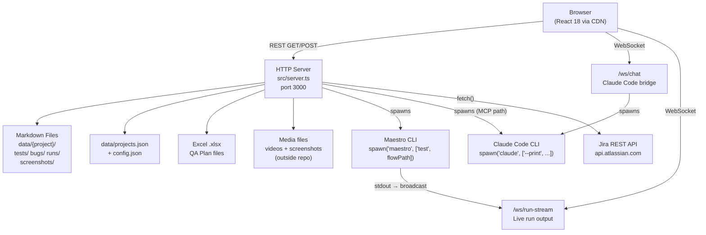

# Architecture: Morbius

**Project:** morbius
**Version:** 1.1
**Updated:** 2026-04-23

---

## Stack

| Layer | Technology | Notes |
|-------|-----------|-------|
| Runtime | Node.js ≥18, TypeScript 5.7 (ES2022/NodeNext) | ESM modules throughout |
| HTTP Server | `node:http` (stdlib) | No Express — raw HTTP handler |
| WebSocket | `ws` 8.20 | Two WS servers multiplexed on same HTTP server |
| CLI | `commander` 12.1 | Entry point: `src/index.ts` |
| Frontend | React 18.3.1 + Babel Standalone 7.29 (CDN) | No build step — embedded in template literal in `src/server.ts` |
| Database | Markdown files + YAML frontmatter | `gray-matter` 4.0 for parse/write; `js-yaml` 4.1 for YAML config files |
| Excel sync | `xlsx` 0.18.5 | Import and export test cases to/from `.xlsx` |
| Fuzzy search | `fuse.js` 7.0 | ⌘K global search across tests, bugs, flows |
| Markdown rendering | `marked` 12.0 | Renders test case steps/criteria in detail panels |
| Build | `tsc` only | Output to `dist/`; `ts-node` for dev mode |

---

## System Architecture



---

## Key Components

### HTTP Server (`src/server.ts`)

Single file handling everything: HTTP routes, WebSocket upgrade, HTML generation, and all business logic. No framework.

**Routes:**

| Method | Path | What it does |
|--------|------|-------------|
| GET | `/` | Serves embedded dashboard HTML (~1MB) |
| GET | `/api/tests` | All test cases for active project |
| GET | `/api/bugs` | All bugs |
| GET | `/api/categories` | Category list with counts |
| GET | `/api/runs` | Run history |
| GET | `/api/dashboard` | Aggregated health data |
| GET | `/api/test/:id` | Single test case detail |
| GET | `/api/bug/:id` | Single bug detail |
| GET | `/api/maestro-tests` | List YAML flows from configured paths |
| GET | `/api/coverage` | Calculator field coverage matrix |
| GET | `/api/appmap` | App navigation Mermaid chart |
| GET | `/api/projects` | All registered projects |
| GET | `/api/device-matrix` | Device × test status grid |
| GET | `/screenshots/:path` | Serve bug screenshots from `data/` |
| GET | `/media/:path` | Serve run media from `mediaPath` (outside repo) |
| POST | `/api/test/update` | Update test status/notes + write changelog |
| POST | `/api/test/reorder` | Reorder cards within a category |
| POST | `/api/test/run` | Spawn Maestro flow directly |
| POST | `/api/test/run-mcp` | Spawn Maestro via Claude Code → MCP |
| POST | `/api/flow/run` | Run YAML flow by path |
| POST | `/api/bug/update` | Update bug status/notes + write changelog |
| POST | `/api/bugs/create` | Create new bug ticket |
| POST | `/api/bugs/:id/sync-jira` | Sync bug status with Jira |
| POST | `/api/bugs/sync-all` | Bulk sync all bugs with Jira |
| POST | `/api/bugs/:id/create-jira` | Create Jira issue from local bug |
| POST | `/api/projects/switch` | Change active project |
| POST | `/api/projects/create` | Create new project |
| POST | `/api/config/update` | Save project config (paths, devices, Jira) |
| POST | `/api/excel/import` | Import Excel via multipart form |
| POST | `/api/runs/ingest-latest` | Parse latest Maestro output |
| GET | `/api/healing` | List validated selector proposals (E-017) |
| POST | `/api/healing/propose` | Enqueue a healing request from a run failure (E-017) |
| POST | `/api/healing/:id/approve` | Apply approved selector to YAML, write changelog (E-017) |
| POST | `/api/healing/:id/reject` | Dismiss proposal (E-017) |
| GET | `/api/bug/:id/impact` | Get cached impact analysis for a bug (E-016) |
| POST | `/api/bug/:id/impact/generate` | Trigger/regenerate Claude impact analysis (E-016) |
| POST | `/api/webhook/jira` | Receive Jira event webhooks → trigger impact regen or sync (E-013, E-016) |
| GET | `/api/jira/health` | Jira sync health status — last sync, error log, queue count (E-013) |
| GET | `/api/sheets/status` | Google Sheets connection + sync status (E-019) |
| POST | `/api/sheets/bind` | Bind a Sheet ID to the active project (E-019) |
| POST | `/api/sheets/sync` | Manual pull from Google Sheets (E-019) |
| GET | `/api/automation-candidates` | AppMap automation candidates for active project (E-018) |
| POST | `/api/automation-candidates/generate` | Trigger Claude candidate generation (E-018) |

### WebSocket Servers

**`/ws/chat`** — Claude Code bridge
- Client sends: `{ message: "ask claude something" }`
- Server spawns: `claude --print --model claude-sonnet-4-6 "<message>"`
- Server streams: `{ type: "chunk" | "info" | "done" | "error", content: "..." }`
- Timeout: 120 seconds; process killed on WS close

**`/ws/run-stream`** — Live test run output
- Client sends: `{ type: "subscribe", runId: "run-034" }`
- Server broadcasts step events from Maestro stdout to all subscribers
- Used by Maestro tab for live test execution progress

### Parsers (`src/parsers/`)

| File | Responsibility |
|------|---------------|
| `markdown.ts` | Read/write test cases and bugs as frontmatter markdown; write changelog entries; load project registry and config |
| `excel.ts` | Parse `.xlsx` sheets → category folders + test markdown; sync changes back; maintain `.sync-meta.json` checksums |
| `maestro-yaml.ts` | Parse YAML → human-readable steps; detect fragile selectors; extract QA Plan ID; **add `replaceSelector(path, old, new)` for E-017** |
| `maestro-results.ts` | Parse Maestro CLI output (commands.json, status.json, report.xml) → TestRun records |
| `calculator-config.ts` | Parse `calculatorConfig.json` field tree; build coverage matrix vs YAML flows and test markdown |
| `google-sheets.ts` *(E-019, new)* | Google Sheets API read/write; mirrors `excel.ts` surface — `importFromSheet(sheetId)`, `exportToSheet(sheetId)`, uses same row→markdown transformer |

### Analyzer (`src/analyzer.ts`)

| Function | What it does |
|----------|-------------|
| `calculateFlakiness(history, window=10)` | Score = transitions ÷ (window−1); 1.0 = perfectly alternating, 0.0 = always same |
| `detectFlakyTests(tests, runs, threshold=0.4)` | Returns tests with score ≥ threshold, sorted descending |
| `analyzeSelectors(yaml)` | Flags `point{}` taps, `sleep >3s`, `index:` selectors |
| `findCoverageGaps(tests)` | Flags: no maestroFlow, not run >7 days, device coverage <50% |
| `buildActivityFeed(bugs, runs, limit=20)` | Recent events: bug_opened, test_failed, run_completed |

### Healing (`src/healing/`) *(E-017, new directory)*

| File | Responsibility |
|------|---------------|
| `selector-proposal.ts` | Full proposal lifecycle: enqueue HealingRequest, orchestrate snapshot → Claude proposal → validation run → write proposal markdown |
| `failure-classifier.ts` | Parse Maestro error output to determine if failure was a selector miss vs. assertion/crash/network |

### Generators (`src/generators/`)

| File | Responsibility |
|------|---------------|
| `maestro-flows.ts` | Generate complete Maestro YAML per calculator section; topological sort on `visibleIf` dependencies; pick test values from field ranges |
| `test-data.ts` | Select sensible test values: midpoint of expectedRange, first non-default singleSelect, etc. |
| `dependency-graph.ts` | Build field dependency map; count which option values trigger the most dependents |

---

## Data Model

### File Layout

```
data/
  projects.json                  ← { activeProject: "micro-air", projects: [...] }
  {projectId}/
    config.json                  ← ProjectConfig
    jira-sync-state.json         ← E-013: { lastSyncAt, pendingWrites[], errorLog[] }
    automation-candidates.md     ← E-018: AppMap automation candidate list
    coverage-scan.md             ← E-020 (gated): legacy app coverage gap report
    regression-plan.md           ← E-021 (drift): per-project regression plan
    tests/
      {category-slug}/
        _category.yaml           ← { id, name, sheet, order }
        tc-{id}-{slug}.md        ← TestCase (frontmatter + markdown body)
    bugs/
      bug-{NNN}.md               ← Bug (frontmatter + markdown body)
      {bugId}/
        impact.md                ← E-016: BugImpact AI analysis (generated)
    runs/
      run-{id}.yaml              ← TestRun (pass/fail counts + per-test results)
    healing/
      proposal-{id}.md           ← E-017: SelectorProposal (generated + reviewed)
    screenshots/
      {bugId}/
        failure-{device}.png
```

### Key Types

```typescript
TestStatus  = 'pass' | 'fail' | 'flaky' | 'not-run' | 'in-progress'
Priority    = 'P1' | 'P2' | 'P3' | 'P4'
BugStatus   = 'open' | 'investigating' | 'fixed' | 'closed'
Platform    = 'ios' | 'android'

// E-016 — Bug-Impact AI
BugImpact = {
  bugId: string; generatedAt: string; bugStatus: BugStatus
  riskScore: number          // 0.0–1.0
  relatedTestsRerun: { testId: string; rationale: string }[]
  relatedTestsManual: { testId: string; rationale: string }[]
  reproNarrative: string
}

// E-017 — Self-Healing Selectors
HealingRequest = {
  id: string; flowPath: string; failedSelector: string
  failureStep: number; runId: string; status: 'pending' | 'snapshotted' | 'proposed' | 'validated' | 'invalidated' | 'approved' | 'rejected'
}
SelectorProposal = {
  id: string; requestId: string; proposedSelector: string
  confidence: number; rationale: string; lowConfidence: boolean
  status: 'validated' | 'invalidated' | 'approved' | 'rejected'
}

// E-018 — AppMap Automation Candidates
AutomationCandidate = {
  flowName: string; priority: 'P0' | 'P1' | 'P2'
  rationale: string; coverageStatus: 'covered' | 'partial' | 'none'
  expectedValueScore: number    // 0.0–1.0
}

// E-020 — Coverage Scan (gated)
CoverageScan = {
  generatedAt: string; appVersion: string; scanDurationMs: number
  coveredFlows: string[]; orphanedTests: string[]
  uncoveredHighRisk: { flow: string; priority: string }[]
}

// E-021 — Regression Plan (drift)
RegressionPlan = {
  schedule: string      // cron expression
  owners: string[]
  nextRun: string       // ISO datetime
}
```

### ProjectConfig fields

```typescript
{
  id: string           // slug (e.g. "micro-air")
  name: string
  excel?: { source: string }              // path to .xlsx
  maestro?: {
    androidPath: string                   // absolute path to Android flows
    iosPath: string                       // absolute path to iOS flows
    loginFlow?: string                    // shared login.yaml path
  }
  env?: Record<string, string>           // TEST_EMAIL, TEST_PASSWORD, etc.
  devices: Device[]
  appId?: string                         // bundle ID
  jira?: {
    cloudId: string
    projectKey: string
    jql?: string
    email?: string
    token: string
    baseUrl?: string
    webhookSecret?: string               // E-013 — Jira webhook HMAC verification
  }
  googleSheets?: {                       // E-019 — new
    refreshToken: string                 // encrypted at rest
    sheetId: string
    pollIntervalMinutes: number          // 5–60
    lastSyncAt?: string                  // ISO
  }
  healing?: {                            // E-017 — new
    enabled: boolean
    minConfidence: number                // proposals below this are low-confidence flagged
  }
  appMap?: string                        // Mermaid flowchart string
  mediaPath?: string                     // path outside repo for run videos
}
```

---

## Maestro CLI Integration

**Direct spawn** (run a flow by path):
```
spawn('maestro', ['test', flowPath], { env: { ...process.env, ...projectEnvVars } })
```

**Via Claude Code → MCP** (run with agent supervision):
```
spawn('claude', ['--print', '--model', 'claude-sonnet-4-6',
  'Run the Maestro flow at path "...". Use mcp__maestro__run_flow_files...'
])
```
Parses `{"status":"pass"}` or `{"status":"fail","error":"..."}` from the last line of Claude's output.

**Version check:**
```
execSync('maestro --version', { timeout: 5000 })
```

---

## Jira Integration

**Auth:** Bearer token (PAT) or Basic auth (base64 email:token)

**Endpoints used:**
```
GET  https://api.atlassian.com/ex/jira/{cloudId}/rest/api/3/issue/{issueKey}
POST https://api.atlassian.com/ex/jira/{cloudId}/rest/api/3/issue
PUT  https://api.atlassian.com/ex/jira/{cloudId}/rest/api/3/issue/{issueKey}
```

**Fields synced:** summary, status, assignee, priority, labels, last comment, issue key, URL

---

## Non-Functional Requirements

| Concern | Approach |
|---------|---------|
| Offline-first | All data lives in local markdown files — no network required to use the dashboard |
| No auth | Single-user local tool until Phase 7 (SaaS) |
| No database | Markdown files are the source of truth — human-readable and git-trackable |
| Hot reload | File system reads on every API call — no in-memory cache to invalidate |
| Port conflict | Configurable via `--port` flag or `PORT` env var |
| Process isolation | Maestro and Claude Code spawn as child processes; server stays up if they crash |

---

## Environment Variables

| Variable | Project | Purpose |
|----------|---------|---------|
| `PORT` | — | Override default port 3000 |
| `TEST_EMAIL` | micro-air | Main test account email |
| `TEST_PASSWORD` | micro-air | Main test account password |
| `DESTROY_EMAIL` | micro-air | Destructive test account (flows 12–14) |
| `DESTROY_PASSWORD` | micro-air | Destructive test account password |
| `OTP_EMAIL` | micro-air | OTP email for password reset flows |
| `CARD_NUMBER` | micro-air | Sandbox payment card (subscription flow) |
| `TEST_USERNAME` | sts | STS calculator test username |
| `TEST_PASSWORD` | sts | STS calculator test password |
| `APP_ID_ANDROID` | sts | `com.sts.calculator` |
| `APP_ID_IOS` | sts | `com.sts.calculator.dev` |

---

## Build + Run

```bash
npm run build       # tsc → dist/
npm start           # node dist/index.js serve
npm run dev         # ts-node (dev, no compile step)

morbius serve --port 3000
morbius import "QA Plan.xlsx"
morbius export "QA Plan.xlsx"
morbius sync --android ../flows/android --ios ../flows/ios
morbius ingest .maestro-output/ --device pixel-7
morbius validate
morbius generate-flows --config calculatorConfig.json --output flows/ --platform ios
```

---

## Planned Extensions (2026-04-23 direction)

These sections document architecture for in-flight epics E-013 through E-022. See [wiki/direction-2026-04.md](wiki/direction-2026-04.md) for sequencing.

### Bug-Impact Analysis (E-016)

**Purpose:** Close Core Four #2 (Ticket→Repro). When a bug changes state (open/fix/reopen) in Jira, regenerate an AI analysis of which tests need to rerun automatically vs. manually.

**Data model** — new markdown under `data/{projectId}/bugs/{bugId}/impact.md`:

```yaml
---
bugId: bug-042
generatedAt: 2026-04-23T14:00:00Z
bugStatus: open
riskScore: 0.72          # 0.0–1.0
---
## Related Tests (Rerun)
- tc-087 (reason: same screen + same field)
- tc-091 (reason: upstream dependency)

## Related Tests (Manual Verify After Fix)
- tc-104 (reason: visual regression risk)

## Repro Narrative
Open app → navigate to Settings → tap Notifications → observe crash...
```

**Generation pipeline:**
1. Trigger: Jira webhook `jira:issue_updated` → matches bug with local Morbius bug → enqueue regen.
2. Input assembly: bug frontmatter + last 3 related runs + linked Maestro YAML + AppMap context.
3. Claude call: existing `claude --print` bridge (same as `/ws/chat`) with an Impact-analysis prompt template.
4. Output write: `data/{projectId}/bugs/{bugId}/impact.md` (overwrites previous generation; version tracked in bug changelog).
5. UI: new "Impact" tab in bug modal, renders markdown via existing `marked` pipeline.

**Cache invalidation:** regenerate on bug status transition OR on explicit user "Refresh analysis" button click. No automatic refresh on unrelated bug edits.

### Self-Healing Selectors (E-017)

**Purpose:** Core Four #1. When a Maestro flow fails due to a selector not resolving, propose a replacement, validate it, and (on approval) update the YAML.

**Flow:**
```
Maestro run fails
    ↓
failure-classifier: was it a selector miss?  (parse Maestro error output)
    ↓ yes
selector-proposal service:
    1. snapshot view hierarchy via mcp__maestro__inspect_view_hierarchy
    2. prompt Claude: "given failed selector X and this hierarchy, propose replacement"
    3. validate: re-run flow with proposed selector in isolation
    4. if passes → emit SelectorProposal record
    ↓
UI: proposal appears in "Healing Queue" panel
    ↓
human review: approve / reject / modify
    ↓ approved
YAML writer: update src/parsers/maestro-yaml.ts → write new selector to flow file
    ↓
changelog entry + run re-queued
```

**Data model** — new markdown under `data/{projectId}/healing/proposal-{id}.md`:

```yaml
---
id: heal-001
flowPath: flows/android/login.yaml
failedSelector: "id:com.app:login_button"
proposedSelector: "text:Sign In"
confidence: 0.88
validatedAt: 2026-04-23T...
status: pending | approved | rejected
---
## Failure Context
- run-id: run-1042
- step: 7 (tapOn)

## Hierarchy Snapshot (truncated)
...

## Rationale (Claude)
The original ID-based selector no longer resolves because...
```

**Critical files:**
- `src/parsers/maestro-yaml.ts` — add `replaceSelector(flowPath, oldSelector, newSelector)` writer.
- New `src/healing/selector-proposal.ts` — proposal lifecycle.
- New route: `POST /api/healing/propose`, `POST /api/healing/:id/approve`, `GET /api/healing`.

### Google Sheets Bidirectional Sync (E-019)

**Purpose:** Live Sheets sync as additive path alongside existing Excel import/export. Preserves Excel upload unchanged.

**Auth:** Google OAuth 2.0 in Settings integrations hub. Tokens stored per-project under `data/{projectId}/config.json` as `googleSheets.refreshToken` (encrypted at rest — use same envelope as `jira.token`).

**Binding:** per-project, one Sheet ID per project (matching one Excel file). Sheet tabs map to categories 1:1 (same as Excel).

**Sync model:**
- **Pull (Sheets → Morbius):** poll every N minutes (configurable 5–60) OR manual "Sync now" button. Uses `spreadsheets.values.get` batch reads per tab.
- **Push (Morbius → Sheets):** triggered on test status change in UI. Writes via `spreadsheets.values.update`.
- **Conflict rule:** per-row timestamp comparison — whichever side was edited last wins. Losing edit logged to `data/{projectId}/tests/{category}/tc-{id}-{slug}.md` changelog as "sheets-conflict-resolved".

**New parser:** `src/parsers/google-sheets.ts` mirrors `excel.ts` surface (`importFromSheet(sheetId)`, `exportToSheet(sheetId)`, uses same row→markdown transformer). No duplicated conversion logic — the row shape is identical.

### Agent Panel UI Pattern (shared across E-016, E-017, E-018)

**Problem:** multiple agents (Bug-Impact, Selector-Healing, AppMap-v2 automation candidates) each want a side panel that (a) shows generated output, (b) lets humans approve / edit / regenerate, (c) exposes a changelog. Rebuilding three panels is wasteful.

**Pattern:** a single `<AgentPanel>` React component in the embedded UI, props:
```
{
  title: string
  content: MarkdownString
  generatedAt: ISOString
  onRegenerate: () => void
  onApprove?: () => void     // optional: healing proposals only
  onReject?: () => void      // optional: healing proposals only
  actions?: CustomAction[]    // e.g., "Generate YAML" for AppMap candidates
}
```

All three agent panels extend this. Keeps visual consistency and reduces maintenance.

### Legacy-App Coverage Scan (E-020, GATED)

**Gate:** Do not build until RF client quality-sensitivity signal confirmed (see brief.md, Bet C strategy).

**When unblocked:** new onboarding variant — upload Excel + app binary path + runs AppMap agent → cross-reference detected flows with uploaded test cases → output `data/{projectId}/coverage-scan.md`:

```yaml
---
generatedAt: ...
appVersion: ...
scanDuration: 4m 12s
---
## Covered Flows (in Excel AND found in app)
- Login
- Password reset

## Orphaned Tests (in Excel, not reachable in app)
- Legacy admin panel

## Uncovered High-Risk Flows (in app, not in Excel)
- Payment flow (priority: P0)
- Onboarding survey (priority: P1)
```

### Regression Plan Wiki (E-021, DRIFT)

**Drift flag:** this is the parked "Anti-Regression Time Machine." User-directed to include; scheduled last.

**Data model:** `data/{projectId}/regression-plan.md` with frontmatter `{schedule: cron-expr, owners: [...], nextRun: ISO}` and body sections (Plan Steps, Linked Suites, Approval Chain).

### Jira Sync Hardening (E-013)

**Fix targets** (audit first in S-013-001; exact failure modes determined at that time):
- Polling auth regressions (tokens expiring silently)
- Webhook drift (Jira webhook deliveries lost, no replay)
- Write-path conflicts (Morbius edit raced with Jira edit, last-write-wins data loss)

**New state:** `data/{projectId}/jira-sync-state.json` — last sync watermark, webhook deliveries log, failed-write queue.
**New UI:** Settings → Integrations → Jira → Health panel (last sync time, pending writes, error log).

---

## Change Log

| Date | Version | Author | Change |
|------|---------|--------|--------|
| 2026-04-21 | 1.0 | PM Agent | Created via reverse-engineer |
| 2026-04-23 | 1.1 | Claude | Added Planned Extensions section for E-013–E-022 — Bug-Impact, Self-Healing Selectors, Sheets Sync, Agent Panel pattern, Legacy Coverage Scan, Regression Wiki, Jira Hardening |
| 2026-04-23 | 1.2 | Claude | Patched main tables: new routes (E-013–E-019), new parser google-sheets.ts + healing/ directory, new Key Types (BugImpact, SelectorProposal, AutomationCandidate, etc.), ProjectConfig additions (googleSheets, healing, jira.webhookSecret), updated data model file layout |
