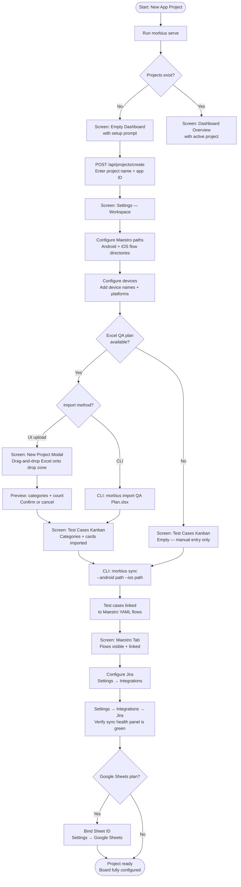

# Flow: Project Onboarding

**ID:** UF-001
**Project:** morbius
**Epic:** E-001, E-002, E-006, E-013, E-014, E-019
**Stage:** Ready
**Version:** 1.1
**Created:** 2026-04-21
**Updated:** 2026-04-23

---

## Goal

A developer sets up a brand-new app project in Morbius — from zero to a fully configured board with test cases imported, Maestro flows linked, and devices configured.

---

## Flow Diagram

---

## Screens

### Screen: New Project Modal with Upload (E-014)
Shown when "Create Project" is clicked. Has two paths: (a) standard — enter name + app ID → create empty project; (b) with Excel — enter name + drag `.xlsx` onto drop zone → file uploads → preview shows detected categories and test count → "Commit" creates the project and imports in one step.

- **Action:** Drag `.xlsx` → preview renders → click "Commit Import" → project created + tests imported
- **Action:** Click "Cancel" → no project created, no files written

### Screen: Empty Dashboard with Setup Prompt
Shown when no projects are registered. Displays a welcome message, a "Create Project" button, and the `morbius import` CLI command hint.

- **Action:** Click "Create Project" → opens new project form → `POST /api/projects/create`

### Screen: Dashboard Overview
Main landing screen after project is selected. Shows overall pass % (0% for a new project), empty category bars, coverage gap warnings highlighting all tests as not-run.

- **Action:** Click "Settings" in sidebar or press `7`

### Screen: Settings — Workspace
Settings tab with Workspace section active. Shows fields for: active project name, Android Maestro path, iOS Maestro path, login flow path, app ID, media path, codebase path.

- **Action:** Fill in Maestro paths → Save → `POST /api/config/update`

### Screen: Settings — Devices
Devices section of Settings. Table of configured devices (name, platform, Excel column mapping). Add/edit/delete devices inline.

- **Action:** Add device → Save → device appears in Device Matrix and bug creation form

### Screen: Test Cases Kanban
Test Cases tab showing imported categories and cards, or empty columns with a "No tests imported" placeholder if Excel import hasn't run.

- **Fragment: Import Success Banner** — shown after `morbius import` completes; shows count of categories and test cases created
- **Parent:** Screen: Test Cases Kanban

### Fragment: Jira Sync Health Panel (E-013)
Visible in Settings → Integrations → Jira. Shows: last successful sync time, status indicator (green/yellow/red), pending write queue count, last 5 errors. QA lead checks this is green before the project is considered "ready."

- **Action:** Click "Sync Now" → health panel refreshes

### Fragment: Google Sheets Binding (E-019)
Visible in Settings → Integrations → Google Sheets. After OAuth, user pastes Sheet URL → "Validate" confirms access → sync enabled. Optional step during onboarding.

### Screen: Maestro Tab
Maestro tab showing file browser of YAML flows from configured paths. After `morbius sync`, cards show linked test IDs in green. Unlinked flows show in grey with "unlinked" label.

- **Action:** Click a flow card → opens YAML viewer overlay

### Overlay: YAML Viewer
Blocking overlay showing: flow name, human-readable steps, raw YAML with syntax highlighting, selector warnings (if any), linked test IDs, Run button.

- **Action:** Click "Run" → `POST /api/flow/run` → flow executes

---

## Edge Cases

- **Excel has template/index sheets** — `morbius import` skips sheets named "Summary", "Index", "Template", "README"
- **Maestro CLI not installed** — Settings shows a red indicator on the Maestro section; Run buttons are disabled with tooltip "Maestro CLI not found"
- **No QA plan available** — Project can still be used with manual test case entry and direct YAML execution

---

## Change Log

| Date | Version | Author | Change |
|------|---------|--------|--------|
| 2026-04-21 | 1.0 | PM Agent | Created via reverse-engineer |
| 2026-04-23 | 1.1 | Claude | Added UI Excel upload path (E-014), Jira health panel check step (E-013), Google Sheets binding option (E-019) |
