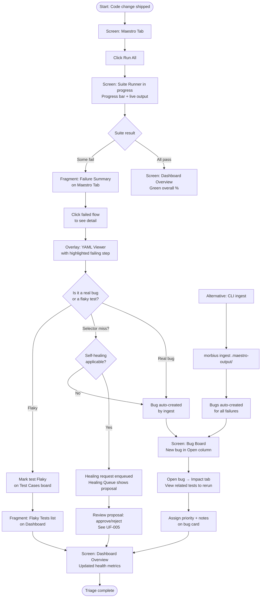

# Flow: Daily Test Run + Triage

**ID:** UF-002
**Project:** morbius
**Epic:** E-003, E-004, E-005, E-015, E-016, E-017
**Stage:** Ready
**Version:** 1.1
**Created:** 2026-04-21
**Updated:** 2026-04-23

---

## Goal

A developer or QA lead runs the full Maestro test suite after a code change, watches results stream live, and triages any failures — updating statuses and filing bugs — all from the dashboard without leaving the browser.

---

## Flow Diagram

---

## Screens

### Screen: Maestro Tab
Seven-tab layout with Maestro tab active. Shows file browser of all YAML flows (Android / iOS toggle). "Run All" button at top. Each flow card shows: name, last run status badge, linked test ID, step count.

- **Action:** Click "Run All" → full suite starts, screen transitions to Suite Runner

### Screen: Suite Runner In Progress
Full-width progress indicator showing: current flow name, X of Y completed, elapsed time. Live log panel below streams Maestro stdout via `/ws/run-stream`. Each step shows ✓ / ✗ / ⟳ as it executes.

- **Action:** Cannot cancel mid-run (destructive flows may have run)
- **Fragment: Failure Summary** — appears inline after suite completes when failures exist

### Fragment: Failure Summary
Inline section on Maestro Tab after suite run. Lists all failed flows with: flow name, failing step, device, duration. Each row links to the YAML Viewer overlay.
- **Parent:** Screen: Maestro Tab

### Overlay: YAML Viewer
Opens from clicking a failed flow. Shows the failing step highlighted in red with the error message. Human-readable translation of that step alongside the raw YAML. "Create Bug" button if no auto-bug was created.

- **Action:** Click "Create Bug" → opens Bug Creation modal
- **Action:** Click "View on Bug Board" if auto-bug exists → navigates to Bug Board

### Fragment: Healing Queue (E-017)
Accessible from the Maestro tab or a top-level "Healing" badge when proposals are pending. Shows validated selector proposals: failed selector, proposed replacement, confidence, diff view. Approve/Modify/Reject buttons. On approve, YAML is updated in-place. See UF-005 for the full self-healing flow.
- **Parent:** Screen: Maestro Tab (or standalone view)

### Screen: Test Cases Kanban
Test Cases tab. Filter by status "Fail" to see only failing tests. Click a card to open detail drawer (now includes Linked Bugs, Run History, Maestro YAML, Device Coverage — see E-015).

- **Action:** Click status pill → change to Flaky → card moves / updates
- **Fragment: Inline Status Update** — status pill click shows dropdown (pass / fail / flaky / in-progress / not-run)

### Fragment: Inline Status Update
Status pill dropdown on any test card. Selecting a new value calls `POST /api/test/update` and writes a changelog entry immediately.
- **Parent:** Screen: Test Cases Kanban

### Screen: Bug Board
Bugs tab with Kanban columns: Open / Investigating / Fixed / Closed. Auto-created bugs appear in Open column. Each card shows: title, linked test ID, device, priority badge, screenshot thumbnail.

- **Action:** Click card → opens Bug Detail Drawer
- **Action:** Click status pill → move bug to Investigating

### Screen: Dashboard Overview
Dashboard tab. Reflects updated health after triage. Shows: new overall pass %, updated category bars, flaky tests section if any flaky marks were set, recent activity feed showing the completed run and any bugs created.

---

## Edge Cases

- **Maestro process exits unexpectedly** — server marks the run as errored; partial results are saved; browser shows "Run ended unexpectedly" in the live log
- **Device disconnected mid-run** — Maestro CLI returns non-zero exit; server treats it as a failure on that flow and continues suite (unless it's a destructive flow)
- **Duplicate failure bug** — if a bug for the same test + device already exists as Open/Investigating, ingest updates it rather than creating a duplicate
- **No Maestro flows linked** — "Run All" button disabled with tooltip "No flows configured — run morbius sync first"

---

## Change Log

| Date | Version | Author | Change |
|------|---------|--------|--------|
| 2026-04-21 | 1.0 | PM Agent | Created via reverse-engineer |
| 2026-04-23 | 1.1 | Claude | Added self-healing branch (E-017), Bug-Impact tab reference (E-016), enriched test detail reference (E-015), Healing Queue fragment |
