# Flow: Bug Lifecycle

**ID:** UF-003
**Project:** morbius
**Epic:** E-004, E-013, E-016
**Stage:** Ready
**Version:** 1.1
**Created:** 2026-04-21
**Updated:** 2026-04-23

---

## Goal

A QA lead manages a bug from creation to resolution — filing it (manually or via auto-create), triaging with the developer, syncing to Jira, and closing it once the fix is verified.

---

## Flow Diagram

```mermaid
flowchart TD
  A([Bug detected]) --> B{Source}
  B -- Maestro failure --> C[Auto-created by ingest\nbug-NNN.md written]
  B -- Manual discovery --> D[Screen: Bug Board\nClick + Create Bug]
  D --> E[Modal: New Bug Form\ntitle, test, device, priority, reason]
  E --> F[POST /api/bugs/create]
  C --> G[Screen: Bug Board\nBug in Open column]
  F --> G
  G --> H[Click bug card]
  H --> I[Screen: Bug Detail Drawer\nFull details + screenshot]
  I --> I2[Click Impact tab\nView AI-generated impact analysis]
  I2 --> I3{Impact available?}
  I3 -- Yes --> I4[See: related tests to rerun\nrisk score + repro narrative]
  I3 -- No/Generating --> I5[Generating... or Regenerate button]
  I4 --> J[Set priority\nAdd notes]
  I5 --> J
  J --> K[Move to Investigating\nClick status pill]
  K --> L{Has Jira project?}
  L -- Yes --> M[Click Create in Jira\nor Sync to Jira]
  M --> N[POST /api/bugs/:id/create-jira\nor sync-jira]
  N --> O[Bug shows Jira badge J\nwith key + URL]
  L -- No --> O2[Bug stays local only]
  O --> P[Developer investigates\nupdates Jira status]
  O2 --> P
  P --> Q[Click Sync All\non Bug Board]
  Q --> QH[Settings → Jira Health Panel\nVerify sync is not degraded]
  QH --> R[POST /api/bugs/sync-all\nJira statuses pulled]
  R --> S[Bug status updates\nfrom Jira]
  S --> T[QA verifies fix\nRe-run Maestro flow]
  T --> U{Flow passes?}
  U -- Yes --> V[Move bug to Fixed\nclick status pill]
  U -- No --> W[Bug stays Investigating\nadd note]
  V --> X[Move to Closed\nafter release ships]
  X --> Y([Bug closed])
```

---

## Screens

### Screen: Bug Board
Bugs tab showing four Kanban columns: Open / Investigating / Fixed / Closed. Cards show: bug title, linked test ID, device, priority badge (P1–P4), screenshot thumbnail (if any), Jira "J" badge (if synced). "Sync All" button in top-right pulls latest Jira statuses.

- **Action:** Click "+ Create Bug" → opens New Bug modal
- **Action:** Click card → opens Bug Detail Drawer
- **Action:** Click status pill → inline column transition

### Modal: New Bug Form
Blocking modal with fields:
- Title (required)
- Linked test ID (required, typeahead from test list)
- Device (dropdown of configured devices)
- Priority (P1 / P2 / P3 / P4)
- Failure reason (textarea)
- Screenshot (file upload, optional)

Submit calls `POST /api/bugs/create`.

### Screen: Bug Detail Drawer
Slides in from right. Contains:
- Bug title + ID + created date
- Status pill (clickable)
- Priority badge (clickable)
- Linked test ID (click navigates to test card)
- Device + Run ID
- Failure reason
- Steps to reproduce
- Screenshot (full inline preview, click to expand)
- Selector analysis warnings (amber inline list if fragile YAML detected)
- Jira section: key, URL, status, assignee, last comment, "Create in Jira" / "Sync" buttons
- Notes textarea (auto-saves on blur)
- Changelog table (every field change with timestamp)
- **Impact tab (E-016):** AI-generated analysis: related tests to rerun (red), related tests to manual-verify after fix (orange), regression risk score with color band, repro narrative. Regenerates automatically on Jira status transitions. "Regenerate" button for manual refresh.

### Fragment: Jira Sync Health Panel (E-013)
Accessible from Settings → Integrations → Jira. If sync is degraded, a warning badge appears on the "Sync All" button on the Bug Board. Clicking it shows last sync time, error count, pending write queue.
- **Parent:** Settings, Bug Board header

### Fragment: Selector Analysis Warning
Shown inside Bug Detail Drawer when the linked test's YAML contains fragile selectors. Lists each warning: type (pixel tap / long sleep / index selector), line number, command.
- **Parent:** Screen: Bug Detail Drawer

### Fragment: Jira Section
Inside Bug Detail Drawer. Shows Jira badge with issue key and URL if synced. Shows: status from Jira, assignee, priority, last comment text. Buttons: "Create in Jira" (if not yet linked), "Sync" (if linked).
- **Parent:** Screen: Bug Detail Drawer

---

## Edge Cases

- **Jira credentials invalid** — sync returns error toast; no local data modified
- **Screenshot path missing** — detail drawer shows "no screenshot" placeholder; bug is otherwise fully functional
- **Bug created for test that doesn't exist** — `linkedTest` stored as-is; detail drawer shows "test not found" if test ID doesn't resolve
- **Duplicate Jira issue** — "Create in Jira" is disabled if `jiraKey` is already set on the bug
- **Bulk sync partially fails** — sync-all returns per-bug status; failed bugs show red error indicator on their cards

---

## Change Log

| Date | Version | Author | Change |
|------|---------|--------|--------|
| 2026-04-21 | 1.0 | PM Agent | Created via reverse-engineer |
| 2026-04-23 | 1.1 | Claude | Added Impact tab path (E-016), Jira health panel check before sync (E-013), updated Bug Detail Drawer with Impact tab description |
