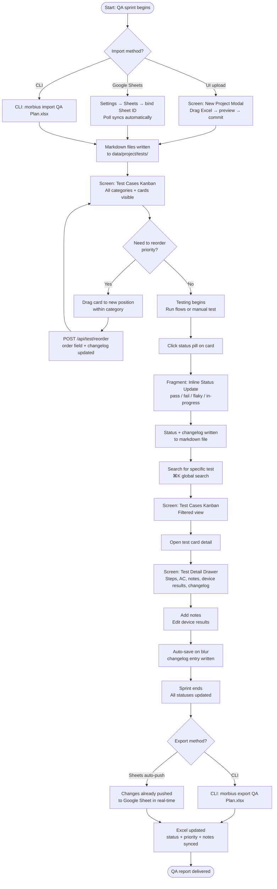

# Flow: Test Case Management

**ID:** UF-004
**Project:** morbius
**Epic:** E-002, E-014, E-015, E-018, E-019
**Stage:** Ready
**Version:** 1.1
**Created:** 2026-04-21
**Updated:** 2026-04-23

---

## Goal

A QA lead imports a QA plan from Excel, manages test case statuses on the board throughout a sprint, and exports the final results back to the Excel file for stakeholder reporting.

---

## Flow Diagram

---

## Screens

### Screen: Test Cases Kanban
Test Cases tab. Cards grouped by category (from Excel sheet names). Columns: Not Run / In Progress / Pass / Fail / Flaky. Filter bar: status chips (All / Pass / Fail / Flaky / Not Run / In Progress / Has YAML) + scenario type chips (Happy Path / Flow / Detour / Negative / Edge Case). Sort bar: ID / Status / Priority / Name / Type. Toggle: Board / Row mode.

- **Action:** Click card → opens Test Detail Drawer
- **Action:** Drag card → reorder within category → `POST /api/test/reorder`
- **Action:** Click status pill → Fragment: Inline Status Update
- **Action:** Press `⌘K` → opens Global Search overlay

### Fragment: Inline Status Update
Status pill dropdown shown on hover. Options: Pass / Fail / Flaky / In Progress / Not Run. Selecting calls `POST /api/test/update`. Card animates to new column.
- **Parent:** Screen: Test Cases Kanban

### Screen: Test Detail Drawer
Slide-in panel from right. Sections:
- Header: test ID, title, category badge, scenario badge, platform icons (iOS / Android), tags
- Status pill + priority badge (both clickable inline)
- Linked Maestro flow path (click to open in Maestro tab)
- Steps (markdown rendered)
- Acceptance Criteria (markdown rendered)
- Device Results table (per-device status — editable)
- Notes textarea (auto-saves)
- Changelog table (every field change)
- Chat toggle (opens Claude Code chat with test context pre-loaded)
- **Linked Bugs panel (E-015):** All bugs referencing this test, with status badge and link to Bug Detail Drawer
- **Run History panel (E-015):** Last 10 runs — date, device, result, duration; click to expand run detail
- **YAML panel (E-015):** Human-readable flow steps (via `maestro-yaml.ts`); if no flow linked, shows "No automated flow" + "Find automation candidates" link (E-018)
- **Device Coverage grid (E-015):** Device × pass/fail/not-run status matrix (from E-005 device matrix data)

### Overlay: Global Search
Full-screen overlay triggered by `⌘K` or `/`. Search across: test IDs, test titles, bug IDs, bug titles, flow names. Powered by fuse.js (fuzzy match). Results categorised by type. Click result to navigate directly.

### Fragment: Device Results Table
Editable table inside Test Detail Drawer. Rows = configured devices, columns = status. Click any cell to update device-specific result. Changes saved immediately via `POST /api/test/update`.
- **Parent:** Screen: Test Detail Drawer

---

## Edge Cases

- **Excel sheet has no header row matching expected columns** — importer scans first 10 rows for a row containing "ID" + ("Steps" or "Scenario"); if not found, the sheet is skipped with a warning
- **Import run twice** — second import uses `.sync-meta.json` checksums; unchanged test cases are skipped; only modified rows update their markdown files
- **Export with deleted test** — if a test case was deleted from Morbius but exists in Excel, the Excel row is left untouched (no deletions)
- **Category with zero tests** — shown as empty column on board; Coverage Gaps flags it as "empty category"
- **Reorder across categories** — not supported; drag-to-reorder works within a category only

---

## Change Log

| Date | Version | Author | Change |
|------|---------|--------|--------|
| 2026-04-21 | 1.0 | PM Agent | Created via reverse-engineer |
| 2026-04-23 | 1.1 | Claude | Added UI Excel upload + Sheets sync import paths (E-014, E-019), enriched Test Detail Drawer with linked bugs / run history / YAML / device coverage (E-015), AppMap candidates link (E-018) |
