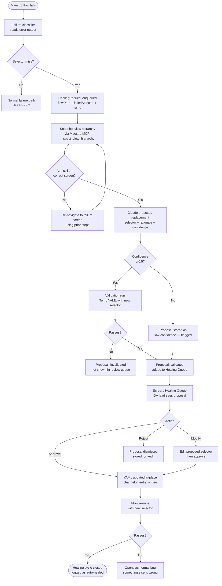

# Flow: Self-Healing Selector Review

**ID:** UF-005
**Project:** morbius
**Epic:** E-017
**Stage:** Draft
**Version:** 1.0
**Created:** 2026-04-23
**Updated:** 2026-04-23

---

## Goal

When a Maestro flow fails due to a stale selector, the system automatically proposes a replacement selector, validates it, and a QA lead reviews the proposal — approving or rejecting it — so that the YAML is updated without manual file editing.

---

## Flow Diagram

---

## Screens

### Screen: Healing Queue
New view in the Maestro tab (or as a badge/overlay). Shows all validated proposals awaiting review. Each card contains:
- Flow name + file path
- Failed selector (before)
- Proposed selector (after)
- Diff view (before/after highlighted)
- Confidence score with color band
- "Low confidence" flag if applicable
- Buttons: Approve / Modify / Reject

- **Action:** Approve → YAML written, card dismissed
- **Action:** Modify → inline input field appears; user edits proposed selector; then approve
- **Action:** Reject → card dismissed to "Rejected" history

### Fragment: Low-Confidence Proposal Flag
Shown on proposals with confidence <0.5. Orange badge + "Review carefully — low confidence." Does not block approval; just surfaces the signal.
- **Parent:** Screen: Healing Queue

### Screen: Healing History
Filter on Healing Queue showing past resolved, rejected, and invalidated proposals. Useful for auditing what changed and when.
- **Action:** Click a historical entry → see the before/after diff and changelog reference

---

## Edge Cases

- **App crashes before hierarchy can be snapshotted** — healing request is marked "snapshot-failed"; no proposal generated; the run is treated as a regular failure
- **Proposed selector matches multiple elements** — Claude must return a uniquely-identifying selector; if hierarchy has duplicates, the proposal is flagged as ambiguous
- **User modifies selector and it fails validation** — validation is re-run on the user's edit before applying to YAML; on failure, user sees "modified selector also failed" and can try again
- **YAML file has been edited since the healing request was created** — diff comparison detects the source file is newer; QA lead is warned before approval

---

## Change Log

| Date | Version | Author | Change |
|------|---------|--------|--------|
| 2026-04-23 | 1.0 | Claude | Created — new flow for E-017 Self-Healing Selectors |
