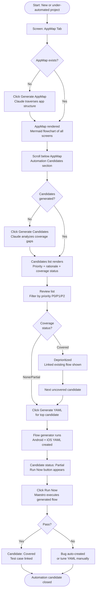

# Flow: AppMap → Automation Planning

**ID:** UF-006
**Project:** morbius
**Epic:** E-006, E-018
**Stage:** Draft
**Version:** 1.0
**Created:** 2026-04-23
**Updated:** 2026-04-23

---

## Goal

A QA lead uses the AppMap (which describes what the app does) to get AI-generated automation candidates — a prioritized list of flows to automate — and then one-click-generates YAML for the top candidates so that automation planning takes minutes, not meetings.

---

## Flow Diagram

---

## Screens

### Screen: AppMap Tab
AppMap tab showing the app's navigation graph as a Mermaid flowchart. Each node = a screen or section. Edge = navigation action. Below the chart: "Automation Candidates" section (new in E-018).

- **Action:** Click "Generate AppMap" → agent runs, chart renders
- **Action:** Scroll to Automation Candidates → see list or "Generate" prompt

### Fragment: Automation Candidates Section (E-018)
Rendered below the AppMap flowchart. Contains:
- Ranked list of flows recommended for automation
- Per-candidate: flow name, priority badge (P0/P1/P2), one-line rationale, coverage status chip (Covered / Partial / None)
- "Generate YAML" button on uncovered/partial candidates
- "View existing flow" link on covered candidates
- Filter bar: Priority / Coverage status

- **Action:** Click "Generate Candidates" → Claude analyzes app map + existing test coverage → list populates
- **Action:** Click "Generate YAML" on a candidate → calls E-006 flow generator → YAML written
- **Action:** Click "Regenerate candidates" → re-runs analysis (useful after new flows are added)

### Fragment: Candidate YAML Preview
Shown after "Generate YAML" completes. Displays the generated flow steps in human-readable form. Buttons: "Run Now" / "Open in Maestro Tab" / "Dismiss."
- **Parent:** Fragment: Automation Candidates Section

---

## Edge Cases

- **No AppMap generated yet** — "Generate Candidates" is disabled; prompt shows "Generate AppMap first"
- **All candidates are already covered** — section shows "Great coverage — no high-priority gaps found" with a date; QA lead can force regeneration to re-check after new features ship
- **YAML generation fails** — candidate stays in "None" state; error message shown inline; no partial file left on disk
- **Candidate rationale is generic** — the agent re-prompts internally (lint check in S-018-002); low-quality rationales should not reach the UI
- **QA lead disagrees with a priority** — no priority override UI in v1; feedback note can be added via the "flag" button (captured for future training signal)

---

## Change Log

| Date | Version | Author | Change |
|------|---------|--------|--------|
| 2026-04-23 | 1.0 | Claude | Created — new flow for E-018 AppMap Agent v2 + Automation Candidates |
