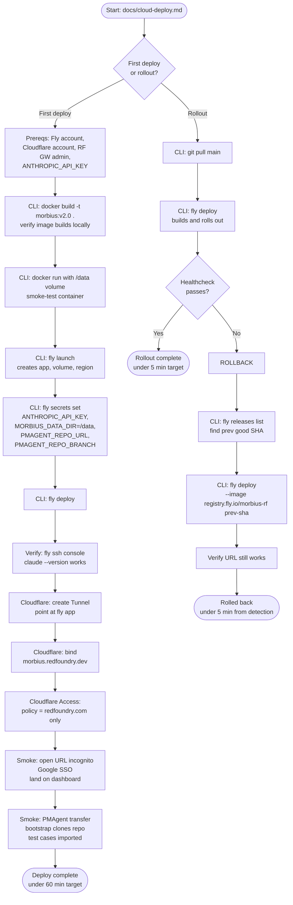

# Flow: Cloud Deploy Operator (v2.0 First-Time Deploy + Ongoing Rollouts)

**ID:** UF-007
**Project:** morbius
**Epic:** E-025
**Stage:** Draft
**Version:** 1.0
**Created:** 2026-04-30
**Updated:** 2026-04-30

---

## Goal

An RF engineer (not Saurabh) takes Morbius from "code in a repo" to "hosted at `https://morbius.redfoundry.dev` behind RF Google Workspace SSO" — first deploy in <60 minutes, subsequent rollouts in <5 minutes. Rollback procedure is documented and reachable in <5 minutes when a bad build ships.

---

## Flow Diagram

---

## Screens

### Doc Page: Prereqs Checklist (`docs/cloud-deploy.md` §1)
First section of the operator runbook. Lists exactly what the operator needs before starting: Fly.io account + `flyctl` installed, Cloudflare account with the RF zone, Google Workspace admin access (for the Access policy), `ANTHROPIC_API_KEY`, deploy key for the PMAgent repo (private). Each item has a checkbox the operator can mentally tick off.

- **Action:** Read top-to-bottom; do not skip — missing prereqs cause the most failed first-deploys

### Doc Page: First-Deploy Walkthrough (`docs/cloud-deploy.md` §2)
Step-by-step `fly launch` + secrets + Cloudflare Tunnel + Access policy. Each step has the exact command, expected output, and "if you see X, check Y" troubleshooting line.

- **Action:** Run commands in order; do not skip ahead

### Fragment: Fly Dashboard — App Created
Shown via `flyctl dashboard` or the web UI. Operator confirms the app exists, the volume is mounted, the region is `iad`, and the machine is running.

- **Action:** Open dashboard → see green "running" status → proceed to Cloudflare setup

### Fragment: Cloudflare Access Policy Editor
Cloudflare's web UI. Operator creates an Access application pointing at `morbius.redfoundry.dev`, attaches a policy "Allow if email ends with @redfoundry.com", uses Google Workspace as the IdP.

- **Action:** Save policy → test with incognito browser

### Doc Page: Rollout (`docs/cloud-deploy.md` §3)
Standard `git pull && fly deploy` recipe. Notes that auto-scale-to-zero is OFF (Morbius needs warmth so SSE/agent runs don't drop), so deploys are zero-downtime rolling deploys.

- **Action:** Push code → `fly deploy` → watch healthcheck

### Doc Page: Rollback (`docs/cloud-deploy.md` §4) — **the panic-button page**
The page operators read at 2am when production is broken. Three commands, in order, with no preamble: `fly releases list` (find last good), `fly deploy --image registry.fly.io/morbius-rf:<sha>` (roll back), `curl https://morbius.redfoundry.dev` (verify). Target: 5 minutes from "this is broken" to "production restored."

- **Action:** Find SHA → deploy SHA → verify

### Doc Page: Troubleshooting (`docs/cloud-deploy.md` §5)
Failure-mode index — operator searches for the symptom they're seeing:
- "Claude CLI says not logged in" → check `ANTHROPIC_API_KEY` Fly secret
- "Playwright errors on Chromium launch" → Dockerfile must use `--with-deps`
- "PMAgent transfer says path not found" → bootstrap script didn't run; check deploy key
- "SSE chat connection drops" → Fly idle-timeout config

- **Action:** Match symptom → apply fix → re-test

### Doc Page: Cost Monitoring (`docs/cloud-deploy.md` §6)
Pointers to: Fly billing dashboard URL, Cloudflare Access usage page (free tier 50-user limit), Anthropic API usage page. Target monthly spend: <$30 infra + Anthropic API per-run.

- **Action:** Bookmark the three URLs; check weekly during first month

---

## Edge Cases

- **First deploy hits the Fly free-tier deny.** The operator's account has unpaid balance or no payment method → `fly launch` fails. Doc points at Fly's billing-setup URL.
- **PMAgent repo deploy key not authorized.** First container start fails because `git clone` returns auth error. Doc shows how to verify the deploy key has read access to the repo, plus the rotation procedure.
- **Cloudflare Access policy is too strict.** Operator typos `@redfoundry.com` as `@red-foundry.com`; nobody can log in. Doc warns to test the policy with an incognito browser BEFORE announcing the URL to the team.
- **Anthropic API quota exceeded mid-run.** First test runs work; later ones return rate-limit errors. Doc points at the Anthropic console for quota limits and the per-project budget setting.
- **Rolling deploy drops an in-flight SSE chat.** `fly deploy` rolls the machine; users with an active chat session see "connection lost." Acceptable for v2.0; documented as known limitation in §5.

---

## Change Log

| Date | Version | Author | Change |
|------|---------|--------|--------|
| 2026-04-30 | 1.0 | Claude | Created — operator-facing flow for E-025 first-deploy + rollout + rollback |
