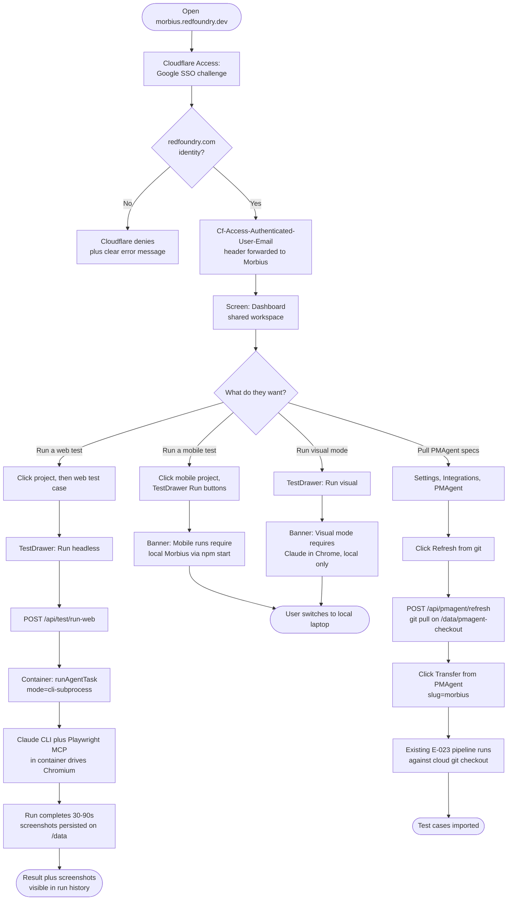

# Flow: RF Team Member Uses Hosted Morbius

**ID:** UF-008
**Project:** morbius
**Epic:** E-025
**Stage:** Draft
**Version:** 1.0
**Created:** 2026-04-30
**Updated:** 2026-04-30

---

## Goal

Any RF team member (PM, dev, QA lead) opens `https://morbius.redfoundry.dev`, signs in with their Google Workspace account, and uses Morbius the way Saurabh does today on his laptop — but without any local install. They run a web test, see results in <90s, and check run history. **Time from URL click to first test result: <2 minutes.**

This flow also documents what does NOT work in the cloud (mobile runs, visual mode) so users know to fall back to local Morbius for those cases.

---

## Flow Diagram

---

## Screens

### Screen: Cloudflare SSO Challenge
Cloudflare-hosted login page. RF logo, Google Workspace SSO button. Non-RF accounts get a denial page with the message "Access restricted to redfoundry.com — contact #morbius for help."

- **Action:** Click "Sign in with Google" → choose `@redfoundry.com` account → redirected to dashboard

### Screen: Dashboard (Shared Workspace)
Same dashboard Saurabh sees locally — projects, test cases, runs, bugs — but it's the **shared** workspace for the RF team. Anyone signed in sees the same data. Header shows the user's email pulled from `Cf-Access-Authenticated-User-Email` (v2.1 will use it for audit trails; v2.0 just displays it).

- **Action:** Switch project via project switcher; click any test case

### Fragment: Mobile Run Banner (Cloud-Only)
Shown in the TestDrawer when `projectType === 'mobile'` AND the user is on the hosted URL (detected via the `Cf-Access-*` header presence). Banner: "Mobile runs require local Morbius — clone the repo and run `npm start`. Cloud Morbius supports web runs only in v2.0."

- **Action:** User clicks "Open local Morbius docs" → goes to `docs/local-setup.md`

### Fragment: Visual Mode Banner (Cloud-Only)
Shown when the user clicks the "Visual" toggle on a web project. Banner: "Visual mode requires Claude in Chrome — runs only on a developer's laptop with the Chrome extension active. Use Headless mode in cloud Morbius."

- **Action:** User reverts to Headless mode OR opens local Morbius

### Screen: Run History (Hosted)
Same `/runs` view as local Morbius. Run records persist on the Fly volume so refreshing the page or restarting the container preserves history. Each run shows the user's email (from the Access header) so the team can see who ran what.

- **Action:** Click a run → see screenshots + step log

### Fragment: PMAgent Refresh-from-Git Card
New UI card in Settings → Integrations → PMAgent for v2.0. Shows: "Last pulled from git: 2 hrs ago" + "Refresh from git" button. Clicking the button hits `POST /api/pmagent/refresh` which runs `git pull` on `/data/pmagent-checkout/`.

- **Action:** Click "Refresh from git" → spinner → "Pulled 3 new commits" toast → Transfer button enabled

### Fragment: Cost / Quota Indicator (optional, v2.0+)
Top-right of the dashboard, small text: "Anthropic API: $X used this month" pulled from the Anthropic usage API if a token is configured. Lets the team self-regulate runs when budget is tight.

- **Action:** Hover for breakdown by project

---

## Edge Cases

- **Two team members edit the same test case simultaneously.** Last-write-wins on the markdown file (v2.0 limitation, Constraint C2). UI does not surface the conflict; the loser's changes are silently overwritten. Documented; revisit if it bites.
- **PMAgent repo authoring done locally on someone's laptop.** They push to git → cloud Morbius doesn't auto-pull. Team member clicks "Refresh from git" in PMAgent integration card to pick up changes.
- **SSE chat drops mid-run during a deploy.** Rolling `fly deploy` cycles the machine; active SSE chat sessions disconnect. UI shows a reconnect prompt; the run itself completed (it's a server-side job) so no data lost.
- **Fly machine restarts (OOM, crash).** `restart_policy=on-failure` brings it back within ~30s. Data on `/data` volume is preserved (project files, run history, screenshots). In-flight runs are lost.
- **Anthropic API key rotated.** Operator runs `fly secrets set ANTHROPIC_API_KEY=...`; next container restart picks it up. No code change.
- **Non-RF user shares a screenshot of the URL externally.** Cloudflare Access still gates the URL — the screenshot recipient cannot reach Morbius without an `@redfoundry.com` Google login. Safe.

---

## Change Log

| Date | Version | Author | Change |
|------|---------|--------|--------|
| 2026-04-30 | 1.0 | Claude | Created — RF-team-facing flow for hosted Morbius usage; documents v2.0 mobile + visual-mode limitations explicitly |
