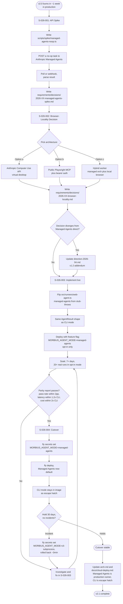

# Flow: v2.1 Managed Agents Migration (Spike → Build → Cutover)

**ID:** UF-009
**Project:** morbius
**Epic:** E-026
**Stage:** Draft
**Version:** 1.0
**Created:** 2026-04-30
**Updated:** 2026-04-30

---

## Goal

Migrate Morbius's web-runner agent path from "CLI subprocess in our Fly container" to "task definition posted to Anthropic Managed Agents." End state: zero CLI/SDK process management in our infra; Anthropic handles agent reliability + retries + concurrency. **Sequencing rule: spike first, build second, cutover third — never skip steps.**

This flow is the lifecycle of E-026, not a single user action. The "user" here is the v2.1 architect (Saurabh + 1 engineer).

---

## Flow Diagram

---

## Screens

### Doc Page: Spike Report (`requirements/decisions/2026-XX-managed-agents-spike.md`)
Output of S-026-001. Covers: auth pattern, request envelope, completion signaling, result schema, error semantics, observed pricing, open questions. The doc that S-026-002 reads to know "what Managed Agents can and can't do."

- **Action:** Architect reads → answers ground-truth questions → moves to S-026-002

### Doc Page: Browser-Locality Decision (`requirements/decisions/2026-XX-browser-locality.md`)
Output of S-026-002. Names the picked option (a/b/c) in the first paragraph; for each rejected option, names the specific blocker; sketches the v2.1 runtime topology; names what stays unchanged from v2.0.

- **Action:** Architect picks one → no second-guessing in S-026-003

### Code Surface: `src/runners/web-agent.ts` (the chokepoint)
Already exists from S-024-003 with three modes; `managed-agents` currently throws. S-026-003 flips it from throws to live. Every web test run flows through this function — both modes produce identical `AgentResult` (screenshots, step log, pass/fail) so the dashboard UI doesn't care which runner ran.

- **Action:** Read existing CLI mode → mirror its result envelope in managed-agents mode

### Fly Secret: `MORBIUS_AGENT_MODE` (the kill switch)
Single Fly secret that toggles the runner. `cli-subprocess` (default through end of S-026-003), `managed-agents` (cutover at S-026-004), `agent-sdk` (fallback path if Managed Agents fails). Setting + redeploy ≈ 3 minutes, which is the rollback budget.

- **Action:** `fly secrets set MORBIUS_AGENT_MODE=<mode>` → `fly deploy`

### Doc Page: Parity Report (S-026-003 → S-026-004 gate)
A dashboard view (or markdown file) comparing CLI mode vs. Managed Agents mode runs over 7+ days: pass rate %, p50/p95 latency, cost per run, failure mode breakdown. If any metric falls outside the gate criteria (pass ±2pp, latency ≤1.2×, cost ≤2×), cutover blocks.

- **Action:** Architect reviews → green-lights or sends back to S-026-003

### Direction Doc Update (`requirements/wiki/direction-2026-04.md` v1.2 — conditional)
Only authored if S-026-002 picks an architecture that diverges from "Managed Agents direct" (e.g., the hybrid worker option). Names the actual chosen architecture so future-you reads what shipped, not what was planned.

- **Action:** Author addendum → check log gets a v1.2 row

---

## Edge Cases

- **Spike reveals Managed Agents pricing is >2× CLI mode.** Per Constraint C4, we either negotiate or stay on v2.0. Document the cost finding in the spike report; do not silently double infra cost.
- **None of options (a)/(b)/(c) survive S-026-002.** Valid outcome. Decision doc records "stay on v2.0 indefinitely" with rationale. E-026 closes without S-026-003 starting. Direction doc gets a v1.2 noting the failed migration.
- **Soak period reveals a pass-rate drop.** Investigate which test cases regress; common root cause is browser-locality (option-specific). Fix in S-026-003 OR re-open S-026-002 if architecture choice was wrong.
- **Post-cutover incident.** Operator runs the kill-switch command (`fly secrets set MORBIUS_AGENT_MODE=cli-subprocess`); production reverts in ~3 minutes. Incident logged; root-cause investigated before re-attempting cutover. CLI mode stays in the image for at least one full release after cutover (Constraint C2) precisely for this case.
- **Cutover holds 30 days without incidents.** Optional follow-up epic to remove the CLI from the Dockerfile (saves ~200MB image size). NOT in E-026 scope; flagged as open optimization.
- **Managed Agents API breaking change post-GA.** Anthropic ships a v2 API; our integration breaks. Kill-switch reverts to CLI mode while we re-do the integration. This is exactly the scenario that justifies keeping CLI as escape hatch.

---

## Change Log

| Date | Version | Author | Change |
|------|---------|--------|--------|
| 2026-04-30 | 1.0 | Claude | Created — lifecycle flow for E-026 v2.1 migration; spike → build → cutover with documented kill-switch |
